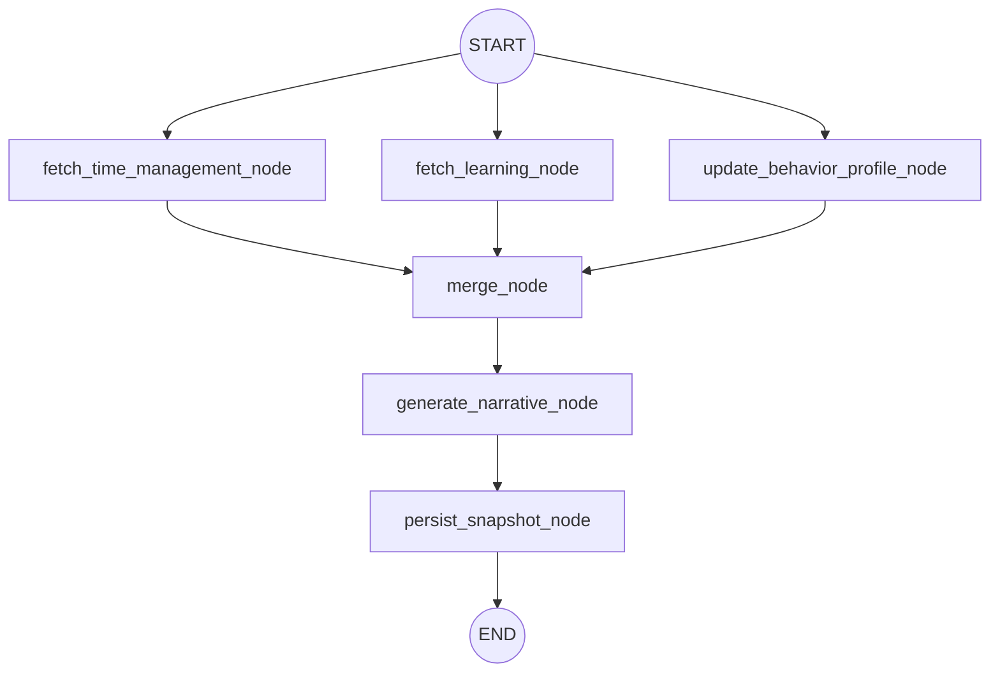

# Analytics Graph Architecture

## 1. Overview

The Analytics Graph is a LangGraph-based workflow within the `fyp-ai-service` designed to construct a comprehensive student analytics profile. It concurrently gathers learning data, time management metrics, and behavior profiles. After fetching, it merges the data into a snapshot, calls an LLM to generate an actionable narrative summary, and persists the results to the Supabase database.

This agent operates primarily in the background, typically triggered via a cron job or scheduled routine, rather than in real-time user-facing flows.

---

## 2. Graph Control Flow

The graph utilizes a fan-out/fan-in parallel processing pattern to minimize latency. 

### Execution Pattern

1. **Parallel Fetching (Fan-out):** `fetch_time_management_node`, `fetch_learning_node`, and `update_behavior_profile_node` all execute simultaneously.
2. **Synchronization (Fan-in):** `merge_node` waits for all three upper nodes to complete before proceeding.
3. **Sequential Processing:** Narrative generation relies on the merged snapshot, and persistence relies on the narrative. Both execute sequentially.
4. **Short-Circuiting / Skip Logic:** If no data exists across the fetch nodes, `merge_node` passes an empty snapshot downstream. The downstream nodes (`generate_narrative_node` and `persist_snapshot_node`) will detect this and return safely without performing any unneeded LLM or database operations.

---

## 3. State Schema (`AnalyticsState`)

The state flowing through the graph is defined in `state.py` as `AnalyticsState` (a `TypedDict`):

| Key | Type | Description |
|---|---|---|
| `user_id` | `str` | The target user identifier. |
| `time_management` | `dict` | Commitment accuracy, reschedule rate, and session follow-through metrics. |
| `learning` | `dict` | Subject mastery, quiz score trends, and weak concepts. |
| `behavior_profile_updated` | `bool` | Flag indicating if user time preferences were successfully upserted. |
| `snapshot_json` | `dict` | The complete aggregated JSON payload, or an empty dict if no data. Controls downstream node execution. |
| `ai_narrative` | `str` | LLM-generated plain text summary (empty if generation is skipped). |
| `computed_at` | `str` | ISO-8601 timestamp representing when the snapshot was persisted. |
| `error` | `str` (Optional) | Caught error message in case of failure. |

---

## 4. Node Details

### A. Fetch Nodes (Parallel)

#### 1. `fetch_time_management_node` (Async)
- **Goal:** Calculates productivity and scheduling behaviors over the last 30 days.
- **Metrics Calculated:**
  - **Commitment Accuracy:** Percentage of tasks completed on or before their original due date.
  - **Reschedule Rate:** Percentage of tasks that were rescheduled at least once.
  - **Session Follow-through:** Percentage of planned work sessions that were actually completed.
- *Failsafe:* Returns an empty dictionary if 0 completed tasks are found.

#### 2. `fetch_learning_node` (Async)
- **Goal:** Analyzes the user's educational progress and mastery.
- **Metrics Calculated:**
  - **Subject Mastery:** Average mastery score per subject (sorted weakest first).
  - **Quiz Trend:** The user's last 10 quiz scores chronologically (useful for front-end charts).
  - **Weak Concepts:** The bottom 3 concepts by mastery score, using hint-usage counts as a tie-breaker.
- *Failsafe:* Returns an empty dictionary if there is no quiz or mastery data to aggregate.

#### 3. `update_behavior_profile_node` (Async)
- **Goal:** Derives contextual study patterns over a 60-day window of completed and cancelled sessions.
- **Logic Constraints:** Requires at least 5 completed sessions to deduce anything meaningful.
- **Metrics Calculated:**
  - Aggregates (day_of_week, hour) pairs to build `preferred_time_slots` and `avoid_time_slots`.
  - Merges contiguous active hours into distinct ranges (e.g., `[{"day": 1, "start": "20:00", "end": "22:00"}]`).
  - Calculates average completion time for tasks from sessions mapped to those tasks.
- **Database Operation:** Directly upserts the findings into the `user_preferences_analytics` table.
- **Returns:** A boolean flag `behavior_profile_updated`.

### B. Aggregation & Generation Nodes (Sequential)

#### 4. `merge_node` (Sync)
- **Goal:** Merges `time_management` and `learning` state dicts into a unified `snapshot_json`.
- **Transformation:** Wraps the combined payload with metadata (e.g., `window_days: 30`).
- **Gatekeeper:** If both dictionaries are empty, `snapshot_json` becomes an empty dict. This serves as a definitive signal to skip steps 5 and 6 gracefully.

#### 5. `generate_narrative_node` (Async)
- **Goal:** Uses Gemini 2.5 Flash to write actionable text for the student.
- **Logic Constraints:** Aborts early (returns `""`) if `snapshot_json` is empty.
- **Implementation:** Prompts the model with a strict system layout alongside the `snapshot_json`.

#### 6. `persist_snapshot_node` (Async)
- **Goal:** Saves the unified snapshot to Supabase.
- **Logic Constraints:** Skipped if `snapshot_json` is empty.
- **Database Operation:** Upserts the `user_id`, `snapshot_json`, `ai_narrative`, and `computed_at` timestamp into the `analytics_snapshots` table. (Updates automatically via conflict constraints on `user_id`).
- **Returns:** An ISO timestamp confirming computation time.

---

## 5. Narrative Prompt Engineering

The system prompt for the `generate_narrative_node` (`narrative_prompt.md`) is strictly engineered to ensure human-readable, non-robotic text.

**Structure Requirements:**
- 2–3 sentences of high-level summarizing.
- Exactly one blank line separation.
- 2–3 bullet points starting with strong action verbs (e.g., "Review", "Focus on", "Break down").

**Tone & Constraints Rules:**
- **No Sycophancy/Hype:** Explicitly forbidden from using words like "amazing", "excellent", "fantastic".
- **No Corporate Jargon:** Banned phrases include "leverage", "optimise", and "going forward".
- **Strict Data Reality:** It must pull actual numbers from the JSON object. It cannot mention missing or null metrics.
- **Length Constraint:** Hard limit of fewer than 120 words total.

---

## 6. Key Design Philosophies & Edge Cases

1. **Idempotency Strategy:** Because this graph often runs via an external scheduler (cron job), it must not crash on duplicate runs. Persistence logic relies heavily on SQL upserts (`ON CONFLICT (user_id) DO UPDATE`).
2. **Graceful Failures:** If a user is entirely new or has zero logged activities, the fetch nodes gracefully return blank dictionaries. The graph safely completes its execution without persisting empty garbage back into the database or throwing a 500 state error.
3. **Behavior Profile Expansion:** To fully leverage the merged contiguous time slots created by `update_behavior_profile_node`, other agents (specifically those in `fetch_context.py` and `run_solver.py` for schedulers) must appropriately translate these slot arrays when resolving user queries.