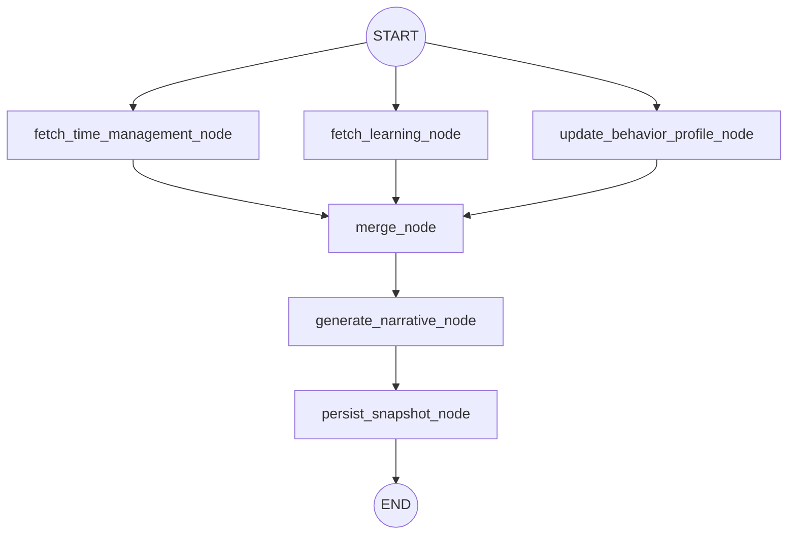

---

## Analytics Agent
Builds a daily snapshot of each student's learning health — session follow-through, mastery trends, and study patterns — then writes an AI-generated coaching summary for in-app display.

```mermaid
graph TD
    START((START))

    START --> fetch_time_management[fetch_time_management_node]
    START --> fetch_learning[fetch_learning_node]
    START --> update_behavior_profile[update_behavior_profile_node]

    fetch_time_management --> merge[merge_node]
    fetch_learning --> merge[merge_node]
    update_behavior_profile --> merge[merge_node]

    merge --> generate_narrative[generate_narrative_node]
    generate_narrative --> persist_snapshot[persist_snapshot_node]
    
    persist_snapshot --> END((END))
```

## How it works

1. **Fan-out** — Three parallel DB queries run simultaneously: time management metrics (commitment accuracy, reschedule rate, session follow-through over 30 days), learning metrics (subject mastery, quiz score trends, bottom-3 weak concepts), and behavior profile update (preferred/avoid time slots derived from 60-day session history).
2. **Merge** — Aggregates all three results into `snapshot_json`. If every fetch node returns empty, sets an empty dict — signaling all downstream nodes to skip without writing garbage to the DB.
3. **Generate narrative** — Gemini 2.5 Flash writes a coaching summary from `snapshot_json` under a strict prompt: 120-word hard limit, no sycophancy or corporate jargon, must cite actual numbers from the JSON.
4. **Persist** — Upserts `snapshot_json` and `ai_narrative` to the `analytics_snapshots` table using `ON CONFLICT (user_id) DO UPDATE` for idempotency across repeated cron runs.

## Key Engineering Decisions

### Fan-out/fan-in parallel fetch
Three independent DB queries — time management, learning metrics, and behavior profile — run concurrently via LangGraph's fan-out; `merge_node` waits for all before proceeding. Total latency stays near the slowest single query rather than their sum.

### Empty-snapshot short-circuit
`merge_node` sets `snapshot_json` to an empty dict when all fetch nodes return nothing. Downstream nodes detect this and return early — no LLM calls, no DB writes — so the graph runs safely on every user daily without pre-filtering at the scheduling layer.

### Strict narrative prompt constraints
The narrative prompt explicitly bans hype words and corporate jargon, requires actual numbers from the snapshot JSON, and enforces a 120-word hard limit. This turns the output into a coaching signal users trust rather than filler text.

---
