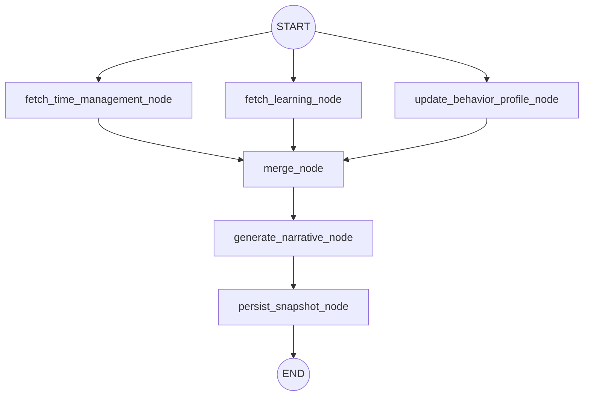

---

**Analytics Agent**
Builds a daily snapshot of each student's learning health — session follow-through, mastery trends, and study patterns — then writes an AI-generated coaching summary for in-app display.

```mermaid
graph TD
    START((START))

    START --> fetch_time_management[fetch_time_management_node]
    START --> fetch_learning[fetch_learning_node]
    START --> update_behavior_profile[update_behavior_profile_node]

    fetch_time_management --> merge[merge_node]
    fetch_learning --> merge[merge_node]
    update_behavior_profile --> merge[merge_node]

    merge --> generate_narrative[generate_narrative_node]
    generate_narrative --> persist_snapshot[persist_snapshot_node]
    
    persist_snapshot --> END((END))
```

**Key Engineering Decisions**

**Fan-out/fan-in parallel fetch**
Time management metrics, learning progress, and behavior profile updates are independent DB queries with no shared dependencies. Running them sequentially would triple the round-trip latency for every analytics run across every user. The fan-out pattern executes all three concurrently and the merge node waits for all before proceeding, keeping total latency close to the slowest single query rather than their sum.

**Empty-snapshot short-circuit**
New users or users with no activity produce empty fetch results, and running narrative generation on empty data wastes tokens and risks hallucinated statistics. The merge node sets `snapshot_json` to an empty dict when both fetch nodes return nothing, and all downstream nodes detect this signal and return early — no DB writes, no LLM calls. This makes the graph safe to run on every user daily without filtering at the scheduling layer.

**Strict narrative prompt constraints**
A general summarization prompt produces vague, sycophantic output ("You're doing amazing!") that users quickly learn to ignore. The narrative prompt explicitly bans positive-hype words, corporate jargon, and references to missing data, while requiring actual numbers pulled from the snapshot JSON and enforcing a hard 120-word limit. This turns the narrative into a trustworthy coaching signal rather than filler text.

---
