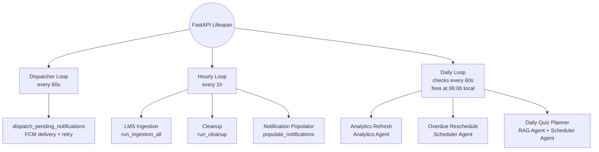

---

## Cron Agent
Coordinates all recurring backend work — push notification delivery, LMS syncing, stale-data cleanup, and daily per-user quiz planning — through three asyncio loops embedded directly in the FastAPI process.

## How it works

1. **Dispatcher (60s)** — Queries `notifications` for pending rows where `send_time ≤ now`, fires a Firebase MulticastMessage per user, deletes delivered rows or increments `retry_count` on failure. After 3 failures marks `status = 'failed'`.
2. **Hourly loop** — Runs LMS ingestion (sync new courses and files via Ingestion Agent), cleanup (prune stale records), and notification populator (scans tasks/events within a 3-day look-ahead window and inserts reminder rows — `UNIQUE` constraints silently deduplicate).
3. **Daily loop** — Polls every 60s but fires once per user per UTC date when the user's local clock crosses 06:00. Runs analytics refresh, overdue session reschedule (Scheduler Agent), and daily quiz planner (up to 3 quizzes via RAG Agent, auto-approved into Scheduler Agent).

## Key Engineering Decisions

### Embedded asyncio over external scheduler
Celery or Cloud Scheduler would require a separate service and broker for a single-service concern. Embedding asyncio loops inside FastAPI's lifespan gives zero infra overhead and natural co-location with the DB — a process restart is the recovery mechanism.

### Three-tier frequency loops
A single 60s loop would run LMS ingestion and analytics on every tick, burning resources on no-op work. Separating into 60s (notification dispatch), 1h (ingestion/cleanup), and daily-at-06:00 (analytics/quiz) matches each job's cost to its run frequency.

### Idempotent notification insertion
The populator always inserts without tracking what it has already queued. DB `UNIQUE` constraints silently ignore duplicates, keeping the populator logic simple and preventing redundant FCM calls across overlapping hourly runs.

---
