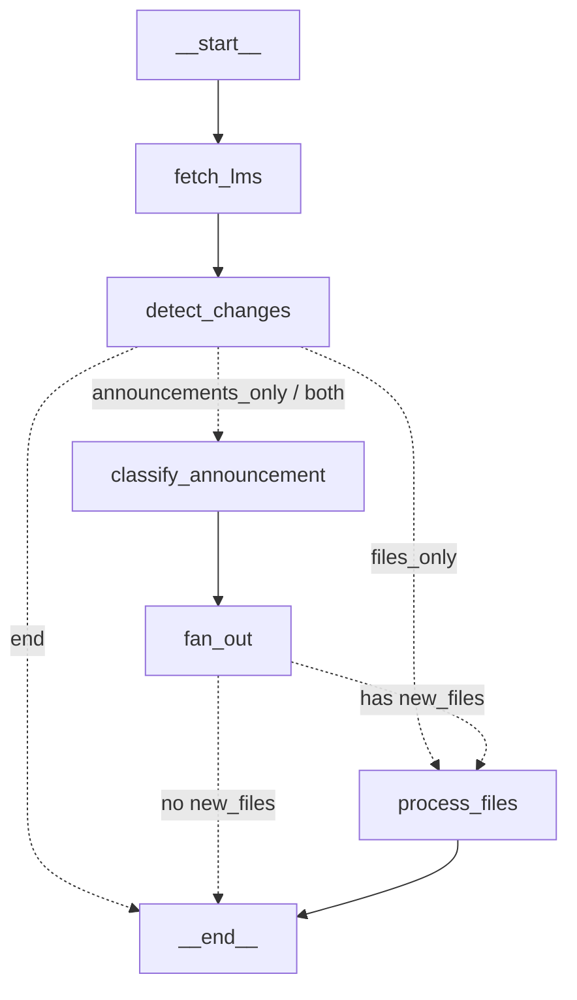

# Ingestion Agent Architecture and Flow

**Primary Objective**: Automatically synchronize and process course data from external Learning Management Systems (LMS) into the academic assistant. It classifies announcements into actionable tasks or calendar events, and processes educational files into semantic learning chunks and knowledge graphs to power spaced repetition and RAG.

**Trigger**: Executed asynchronously in the background via the `/cron/ingest` scheduled endpoint (invoking the `run_ingestion` function).

The Ingestion Agent is an asynchronous background pipeline that syncs data from external Learning Management Systems (LMS) into the AI assistant's database. It is implemented using LangGraph and handles both course announcements and learning materials (files).

## High-Level State Graph

## State Definition

The `IngestionState` tracks the following data throughout the execution:
- **Inputs**: `course_id`, `lms_course_id`
- **LMS Data**: `announcements` (flattened list), `files` (flattened list)
- **Filtered Data**: `new_announcements`, `new_files` (unseen items only)
- **Processing Results**: `task_event_announcements`, `announcement_results`, `file_results`, `errors`

## Detailed Node Breakdown

### Phase 2: LMS Fetch & Change Detection

#### 1. `fetch_lms_node`
- **Purpose**: Retrieves all course data from the mock LMS via HTTP.
- **Action**: Iterates through the returned course weeks and flattens all nested items into two primary lists: `announcements` and `files`.
- **Output**: Populates the `announcements` and `files` lists in the state.

#### 2. `detect_changes_node`
- **Purpose**: Filters out data that has already been ingested to prevent duplicate processing.
- **Announcements**: Deduplicates based on the LMS `item_id` by checking the `processed_lms_items` database table.
- **Files**: Downloads the actual file bytes, computes the SHA-256 hash, and queries the `course_topics` table to check if the exact file content has already been processed. Passes the `file_bytes` forward for new files to avoid re-downloading later.
- **Output**: Populates `new_announcements` and `new_files`.

### Routing (Conditional Edge)

- **`route_after_detect`**: Evaluates the presence of new announcements and files.
  - `end`: If neither lists have items, execution terminates.
  - `files_only`: Skips to `process_files_branch`.
  - `announcements_only` / `both`: Proceeds to `classify_announcement_node` initially.

### Phase 3: Announcement Branch

#### 3. `classify_announcement_node`
- **Purpose**: Rapidly determines if an announcement requires action from the student.
- **Action**: Uses a fast LLM (`gemini-2.5-flash-lite`) systematically prompted with a `<difficulty_tier_rubric>` and few-shot examples to classify each new announcement as:
  - `task_event`: Requires student action (e.g., assignment released, schedule change). Retained.
  - `info`: Simple information (e.g., lecture recording uploaded). Discarded and marked as processed immediately.
- **Output**: Populates `task_event_announcements`.

#### 4. `fan_out_node`
- **Purpose**: Processes actionable announcements uniquely for every enrolled student.
- **Action**: 
  - Retrieves all users enrolled in the given course.
  - Iterates through each user and each `task_event` announcement.
  - Sequentially invokes a helper `_parse_and_save` to execute the **Parser Agent** (`run_parser`), which uses LLM logic with Chain of Thought to parse attributes like `due_date`, `priority`, or `event_type`.
  - Saves the resulting item into the `tasks` or `calendar_events` database tables.
  - Queues an FCM push notification (invokes `_queue_lms_notification`) for the user.
  - Optionally, if the parsed item qualifies (like an assessment event) and the user has opted-in to `auto_decompose_lms`, it triggers an internal HTTP request to the **Scheduler Agent** to block out time automatically.

### Routing (Conditional Edge)

- After the `fan_out_node`, a lambda edge checks if there are `new_files` pending. If so, it routes to `process_files`, else `__end__`.

### Phase 4 & 5: File Extraction, Chunking, Storage, and Knowledge Graph (Mindmap)

#### 5. `process_files_branch`
- **Purpose**: Processes educational documents through text extraction, chunking, persistence, and knowledge graph generation. Acts as a standalone pipeline for each pending file.
- **Action**:
  - Validates against race conditions (`dedup_check_node`).
  - **`extract_node`**: Extracts text based on file format (.pdf via PyMuPDF, .docx via python-docx, .pptx via python-pptx) and produces a structured markdown representation of the document.
  - **`semantic_chunk_node`**: Sends the full extracted markdown to an LLM (`gemini-3-flash-preview`) specifically prompted with a rubric to perform *semantic chunking*. It splits the document into distinct academic concepts, duplicates necessary context, and assigns a `difficulty_tier` scale (1-5) used later by FSRS spaced repetition algorithms.
  - **`store_chunks_node`**: Upserts the file metadata into the `course_topics` table. Then upserts the structured chunks into `learning_chunks` table, removing any stale "tail" chunks if the updated document possesses fewer distinct sections than the previous ingest.
  - **`graph_extract_node`**: Constructs a semantic knowledge graph (mindmap) representing relationships between the extracted concepts. Uses an LLM to generate a Directed Acyclic Graph (DAG) with specific relationship primitives (`includes`, `requires`, `contrasts with`), validates and constructs it using `networkx`, and saves the serialized structure (`graph_json`) back into the `course_topics` table.