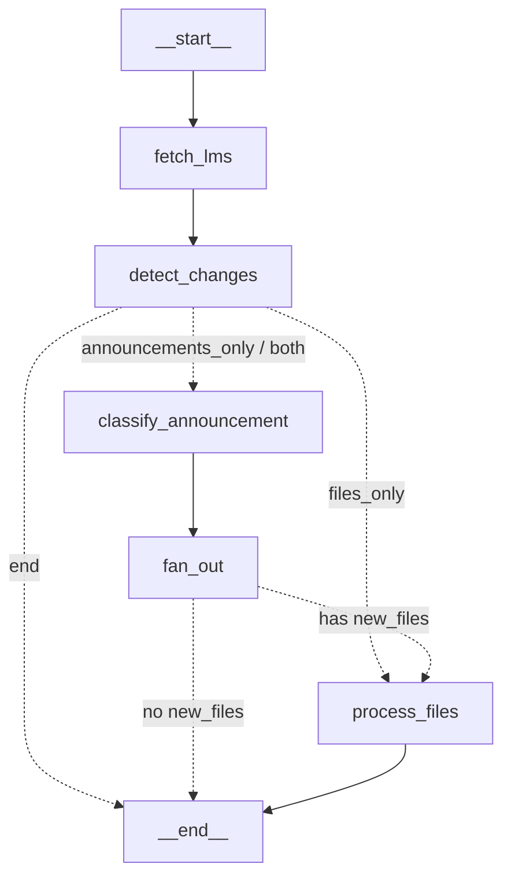

---

## Ingestion Agent
Polls the LMS for new course content, classifies announcements as actionable tasks or calendar events, and converts uploaded files into semantically chunked learning material that powers quizzes and spaced repetition.

```mermaid
graph TD
    __start__ --> fetch_lms
    fetch_lms --> detect_changes
    detect_changes -. "announcements_only / both" .-> classify_announcement
    detect_changes -. "files_only" .-> process_files
    detect_changes -. "end" .-> __end__
    
    classify_announcement --> fan_out
    fan_out -. "has new_files" .-> process_files
    fan_out -. "no new_files" .-> __end__
    
    process_files --> __end__
```

## How it works

1. **Fetch** — HTTP call to the mock LMS (`/weeks` endpoint), flattening all nested week items into `announcements` and `files` lists.
2. **Detect changes** — Announcements deduplicated by `item_id` against `processed_lms_items`. Files deduplicated by SHA-256 hash against `course_topics` — bytes are downloaded once and passed forward to avoid re-downloading.
3. **Route** — If nothing new, exits immediately. Otherwise routes to announcement classification, file processing, or both.
4. **Classify announcements** — `gemini-2.5-flash-lite` tags each announcement as `task_event` (actionable) or `info` (discard). Only actionable announcements proceed.
5. **Fan-out** — For each enrolled user × each actionable announcement: invokes the Parser Agent to extract structured fields, saves to `tasks` or `calendar_events`, queues an FCM notification, and optionally triggers the Scheduler Agent for users with `auto_decompose` enabled.
6. **Process files** — Extracts text (PyMuPDF / python-docx / python-pptx), semantically chunks via LLM (assigning difficulty tiers 1–5), stores to `learning_chunks`, then builds a concept knowledge graph (networkx DAG) saved as `graph_json`.

## Key Engineering Decisions

### Content-hash deduplication
LMS timestamps are unreliable — a minor metadata update can re-export the same file with a new timestamp. SHA-256 hashing the actual file bytes guarantees already-processed content is never re-chunked, preventing duplicate knowledge graph nodes and wasted LLM calls.

### Semantic chunking via LLM
Rule-based chunking splits where markup appears, not where concepts change. An LLM-driven chunker produces one chunk per academic concept, assigns a difficulty tier (1–5), and duplicates necessary context — making downstream RAG retrieval and FSRS scheduling meaningful rather than arbitrary.

### Per-user fan-out for actionable announcements
Each user needs their own task/event record with personal metadata (deadline offsets, FCM tokens, auto-decompose flags). The fan-out iterates enrolled users individually, enabling personalized scheduling and push notifications without sharing mutable state.

---
