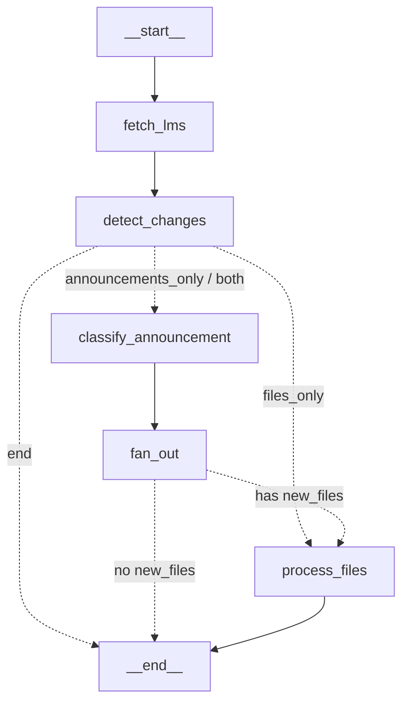

---

**Ingestion Agent**
Polls the LMS for new course content, classifies announcements as actionable tasks or calendar events, and converts uploaded files into semantically chunked learning material that powers quizzes and spaced repetition.

```mermaid
graph TD
    __start__ --> fetch_lms
    fetch_lms --> detect_changes
    detect_changes -. "announcements_only / both" .-> classify_announcement
    detect_changes -. "files_only" .-> process_files
    detect_changes -. "end" .-> __end__
    
    classify_announcement --> fan_out
    fan_out -. "has new_files" .-> process_files
    fan_out -. "no new_files" .-> __end__
    
    process_files --> __end__
```

**Key Engineering Decisions**

**Content-hash deduplication**
Timestamps are unreliable for detecting file changes — an LMS can re-export the same file with a new timestamp after a minor metadata update. Downloading the file bytes and computing a SHA-256 hash before inserting guarantees that already-processed content is never reprocessed, regardless of LMS metadata. This prevents both wasted LLM calls on duplicate chunks and corrupted knowledge graphs from duplicate concept nodes.

**Semantic chunking via LLM**
Rule-based chunking by heading or page break splits documents where the markup appears, not where the concepts change. Using an LLM to chunk means each chunk maps to a single academic concept, receives a difficulty tier, and duplicates necessary context — making downstream RAG retrieval and FSRS scheduling meaningful rather than arbitrary. The difficulty tier (1–5) produced here flows directly into quiz generation and spaced repetition scheduling in other agents.

**Per-user fan-out for actionable announcements**
Persisting one announcement and referencing it from every user would be simpler, but each user needs their own task or calendar event entry with personal metadata — deadline offsets, auto-decompose flags, and individual FCM tokens. The fan-out node iterates enrolled users and invokes the Parser Agent per user, enabling personalized scheduling decisions and individual push notifications without sharing mutable state across users.

---
