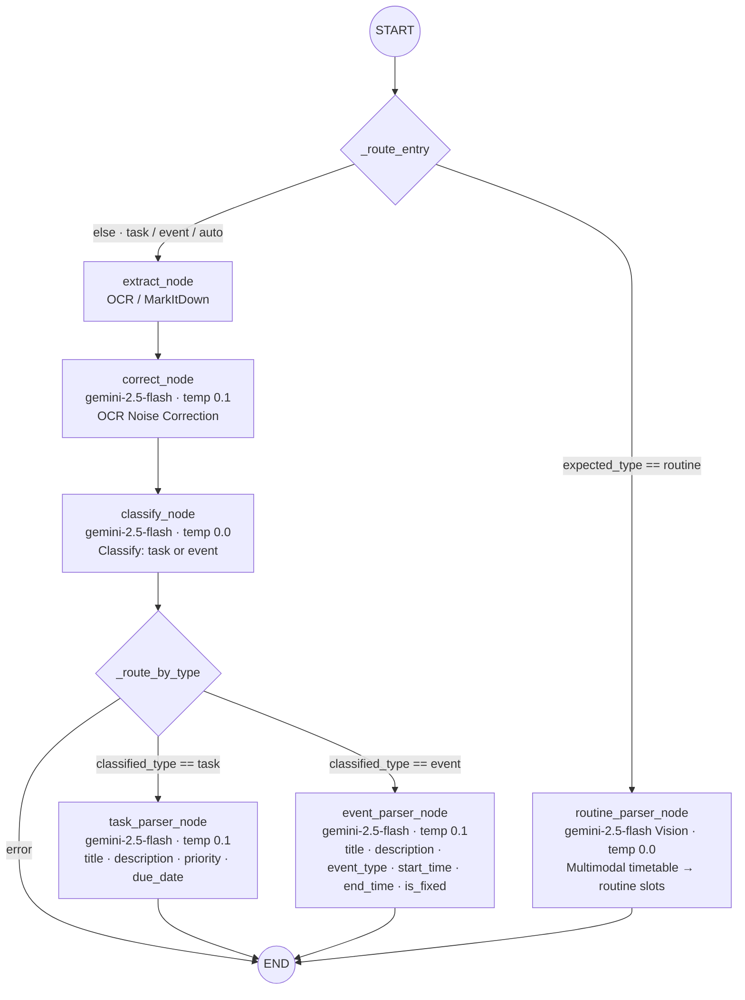

# Parser Agent Architecture & Flow

This document details the complete architecture, data flow, and processing steps of the **Parser Agent** in the `fyp-ai-service`. The Parser Agent uses [LangGraph](https://python.langchain.com/docs/langgraph) to orchestrate a multi-step pipeline capable of converting raw unstructured input (text and files/images) into well-structured Academic Tasks, Events, or Schedule Routines.

## Graph Overview

The Parser Agent uses a state machine (`ParserState`) to pass artifacts between nodes.

### Schema (`ParserState`)

- **Inputs**: `user_id`, `text`, `file_bytes_list` (files uploaded by user), `current_time`, `timezone`, `expected_type` (can be `task`, `event`, `routine`, or `auto`), `context`.
- **Intermediate**: `extracted_text` (from raw OCR/parsing), `corrected_text` (LLM-cleaned OCR), `classified_type` (determined by the LLM as `task` or `event`).
- **Outputs**: `result` (dictionary of parsed fields), `error`.

### Node Map & Edges

1. **Conditional Entry Point (`_route_entry`)**: Check if `expected_type == "routine"`.
   - If `routine` $\rightarrow$ Routes to `parse_routine` (bypassing text-based OCR).
   - Else $\rightarrow$ Routes to `extract`.
2. **`extract` Node**: Reads text from files.
   - $\rightarrow$ Transitions to `correct`.
3. **`correct` Node**: Cleans up OCR anomalies.
   - $\rightarrow$ Transitions to `classify`.
4. **`classify` Node**: Determines whether the user intent is a `task` or an `event`.
   - $\rightarrow$ Conditional Edge (`_route_by_type`).
5. **Conditional Router (`_route_by_type`)**:
   - If error $\rightarrow$ `END`.
   - If `classified_type == "task"` $\rightarrow$ Routes to `parse_task`.
   - If `classified_type == "event"` $\rightarrow$ Routes to `parse_event`.
6. **Leaf Nodes**:
   - **`parse_task`**: Extracts Task fields. $\rightarrow$ `END`
   - **`parse_event`**: Extracts Event fields. $\rightarrow$ `END`
   - **`parse_routine`**: Extracts Routine fields multimodally. $\rightarrow$ `END`

---

## Graph Control Flow

### Execution Pattern

1. **Standard Path (task / event / auto):** Entry routes to `extract_node`, then sequentially through `correct_node` and `classify_node` before fanning out to the appropriate leaf parser.
2. **Routine Fast-Path:** `expected_type == "routine"` bypasses all OCR and classification nodes entirely, jumping directly to `routine_parser_node`. This preserves the spatial layout of timetable images by sending raw bytes to Gemini Vision instead of running EasyOCR.
3. **Rate-Limit Fallback:** All LLM calls in leaf nodes use `_invoke_with_retry`, which falls back from `gemini-2.5-flash` to `gemini-2.0-flash` on a single 429 / `RESOURCE_EXHAUSTED` error.
4. **Error Short-Circuit:** If any node writes to `state["error"]`, `_route_by_type` routes directly to `END` without invoking any leaf parser.

---

## Detailed Step-by-step Flow

### 1. Initial Routing (`_route_entry`)

The pipeline checks the `expected_type` provided in the initial state.
- **Routine Parsing:** If the user is explicitly uploading a typical academic timetable or requests schedule routine extraction (`expected_type="routine"`), it jumps directly to `routine_parser_node`. This avoids the standard OCR pipeline because schedules are better parsed with Vision models that understand spatial arrangement (columns/rows).
- **Standard Parsing:** For everything else (or `auto`), the flow enters `extract_node`.

### 2. Text Extraction (`extract_node`)

Iterates through all uploaded files (`file_bytes_list`) and extracts raw text based on file extensions.
- **Images (`.png`, `.jpg`, `.jpeg`, etc.)**: 
  - Converts bytes to an OpenCV image array.
  - Passes the image to [EasyOCR](https://github.com/JaidedAI/EasyOCR) (`_get_ocr_reader()`) to execute bounding-box text recognition.
- **Documents (`.pdf`, `.docx`, `.txt`, etc.)**:
  - Uses `MarkItDown` (Microsoft) to convert office/PDF files into Markdown content.
- All text pieces are concatenated sequentially and saved into the state as `extracted_text`.

### 3. OCR Correction (`correct_node`)

Raw OCR text is often messy (e.g., `"sqm Culfwrz cznter"` instead of `"SGM Cultural Center"`).
- **Skip Check**: If `extracted_text` is empty, it skips correction.
- **LLM Call**: Uses `gemini-2.5-flash` with low temperature (0.1).
- **Action**: Injects `extracted_text` into `ocr_correction_prompt.md`. The LLM returns a sanitized, human-readable version of the text.
- Updates the state with `corrected_text`.

### 4. Intent Classification (`classify_node`)

If the user didn't force a type, the agent must figure out what the combined text and files represent.
- **Inputs**: Original user `text` and `corrected_text` (or `extracted_text`).
- **LLM Call**: `gemini-2.5-flash` at temperature `0.0` (fully deterministic).
- **Action**: Uses `classify_prompt.md` to classify the request strictly as `"task"` or `"event"`.
- Updates the state with `classified_type`.

### 5. Extraction Leaf Nodes

Based on `classified_type` (or the initial skip to `routine`), parallel execution is fanned out to specific data wrappers. All leaf nodes make use of an `_invoke_with_retry` safety utility that falls back to `gemini-2.0-flash` if `gemini-2.5-flash` faces a 429 Rate Limit error.

#### A. Task Parser (`task_parser_node`)
- **Trigger**: `classified_type == "task"`
- **Prompt**: `task_parser_prompt.md`
- **Action**: Analyzes inputs alongside the real current time & timezone and the user's existing context context.
- **Outputs**: JSON containing extracted `title`, `description`, `priority`, and `due_date`. 

#### B. Event Parser (`event_parser_node`)
- **Trigger**: `classified_type == "event"`
- **Prompt**: `event_parser_prompt.md`
- **Action**: Identical context ingestion as the task parser, but focused on scheduling.
- **Outputs**: JSON containing `title`, `description`, `event_type`, `start_time`, `end_time`, and whether the timeline `is_fixed`.

#### C. Routine Parser (`routine_parser_node`)
- **Trigger**: `expected_type == "routine"` (via `_route_entry`)
- **Action**: Acts as a **Multimodal** node. Instead of using `extracted_text`, it passes the raw image bytes (encoded in base64 as native image blocks) directly into the Gemini prompt (`routine_parser_prompt.md`).
- **Advantage**: Gemini processes the visual layout exactly as the user sees it, preventing OCR data collapse.
- **Outputs**: A mapped dictionary of time slots mapped to specific classes or routines.

### 6. Finalization (`run_parser`)

The `run_parser` async function wraps the graph compilation and execution. Once the LangGraph pipeline concludes at the `END` state, the wrapper checks `final_state["error"]`. If none exist, it extracts and returns `final_state["result"]`.
