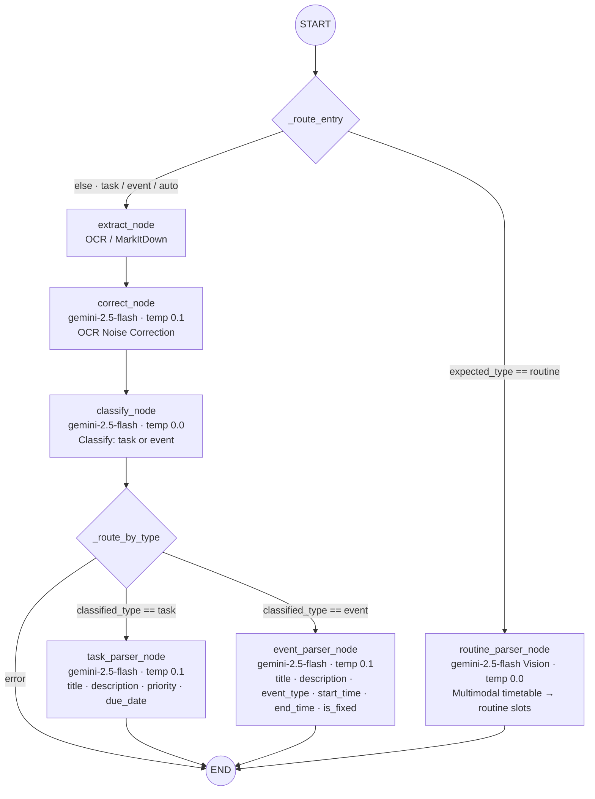

---

**Parser Agent**
Converts unstructured input — typed text, scanned documents, and timetable images — into structured task, event, or routine records through a staged extract-correct-classify-parse pipeline.

```mermaid
graph TD
    START((START))
    END((END))

    route_entry{_route_entry}
    extract[extract_node\nOCR / MarkItDown]
    correct[correct_node\ngemini-2.5-flash · temp 0.1\nOCR Noise Correction]
    classify[classify_node\ngemini-2.5-flash · temp 0.0\nClassify: task or event]
    route_type{_route_by_type}
    parse_task[task_parser_node\ngemini-2.5-flash · temp 0.1\ntitle · description · priority · due_date]
    parse_event[event_parser_node\ngemini-2.5-flash · temp 0.1\ntitle · description · event_type · start_time · end_time · is_fixed]
    parse_routine[routine_parser_node\ngemini-2.5-flash Vision · temp 0.0\nMultimodal timetable → routine slots]

    START --> route_entry
    route_entry -- "expected_type == routine" --> parse_routine
    route_entry -- "else · task / event / auto" --> extract
    extract --> correct
    correct --> classify
    classify --> route_type
    route_type -- "error" --> END
    route_type -- "classified_type == task" --> parse_task
    route_type -- "classified_type == event" --> parse_event
    parse_task --> END
    parse_event --> END
    parse_routine --> END
```

**Key Engineering Decisions**

**Routine fast-path bypassing OCR**
Timetables are spatially structured — classes arranged in columns and rows that OCR collapses into a flat string, destroying the schedule layout. Sending raw image bytes directly to Gemini Vision preserves the spatial context the model needs to correctly map time slots to classes. All other input types still go through EasyOCR and LLM correction because they are prose, not layout.

**Classify before parse**
Parsing a task and an event require different field sets, and a single combined extraction prompt produces ambiguous JSON with overlapping fields that neither schema can cleanly validate. Classifying first at temperature 0.0 — fully deterministic — lets each downstream leaf parser focus on its exact schema without hedging. The classification step also provides a clean error short-circuit: any classify failure routes directly to END before the more expensive parse nodes run.

**Rate-limit fallback model**
Retrying the same model on a 429 error burns quota and adds latency proportional to the retry wait. Falling back immediately to `gemini-2.0-flash` on a single RESOURCE_EXHAUSTED error keeps the pipeline responsive under load without complex backoff logic. The fallback model is slightly less capable, but it completes the request rather than timing out the user.

---
