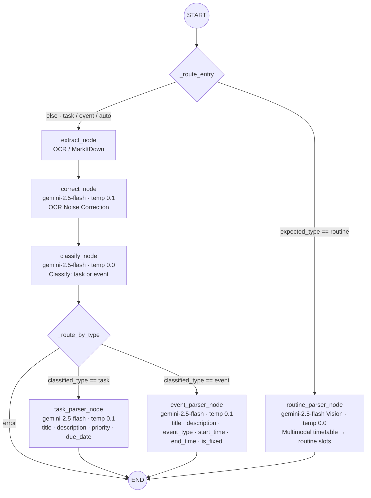

---

## Parser Agent
Converts unstructured input — typed text, scanned documents, and timetable images — into structured task, event, or routine records through a staged extract-correct-classify-parse pipeline.

```mermaid
graph TD
    START((START))
    END((END))

    route_entry{_route_entry}
    extract[extract_node\nOCR / MarkItDown]
    correct[correct_node\ngemini-2.5-flash · temp 0.1\nOCR Noise Correction]
    classify[classify_node\ngemini-2.5-flash · temp 0.0\nClassify: task or event]
    route_type{_route_by_type}
    parse_task[task_parser_node\ngemini-2.5-flash · temp 0.1\ntitle · description · priority · due_date]
    parse_event[event_parser_node\ngemini-2.5-flash · temp 0.1\ntitle · description · event_type · start_time · end_time · is_fixed]
    parse_routine[routine_parser_node\ngemini-2.5-flash Vision · temp 0.0\nMultimodal timetable → routine slots]

    START --> route_entry
    route_entry -- "expected_type == routine" --> parse_routine
    route_entry -- "else · task / event / auto" --> extract
    extract --> correct
    correct --> classify
    classify --> route_type
    route_type -- "error" --> END
    route_type -- "classified_type == task" --> parse_task
    route_type -- "classified_type == event" --> parse_event
    parse_task --> END
    parse_event --> END
    parse_routine --> END
```

## How it works

1. **Route entry** — If `expected_type == "routine"`, jumps directly to `parse_routine` (Gemini Vision). All other types enter the standard extract → correct → classify pipeline.
2. **Extract** — Images run through EasyOCR (bounding-box recognition); documents (PDF, DOCX, TXT) run through MarkItDown. All text is concatenated into `extracted_text`.
3. **Correct** — `gemini-2.5-flash` at temp 0.1 cleans OCR noise (e.g., `"sqm Culfwrz cznter"` → `"SGM Cultural Center"`), producing `corrected_text`.
4. **Classify** — `gemini-2.5-flash` at temp 0.0 (fully deterministic) classifies the input as `task` or `event`. Any error here short-circuits to END before the more expensive parse nodes run.
5. **Parse** — The matching leaf node extracts its schema: task (`title`, `description`, `priority`, `due_date`) or event (`title`, `description`, `event_type`, `start_time`, `end_time`, `is_fixed`). Routine parser sends raw image bytes directly to Gemini Vision to preserve timetable spatial layout.

## Key Engineering Decisions

### Routine fast-path bypassing OCR
OCR collapses a timetable's column/row layout into a flat string, destroying the schedule structure. Sending raw image bytes directly to Gemini Vision preserves spatial context — all other input types still go through EasyOCR because they are prose, not layout.

### Classify before parse
A single combined extraction prompt produces ambiguous JSON that neither task nor event schema can cleanly validate. Classifying first at temp 0.0 lets each leaf parser focus on its exact schema, and any classification failure short-circuits before the more expensive parse nodes run.

### Rate-limit fallback model
Retrying the same model on a 429 burns quota and adds latency proportional to the retry wait. A single `RESOURCE_EXHAUSTED` error immediately falls back to `gemini-2.0-flash` to complete the request rather than timing out the user.

---
