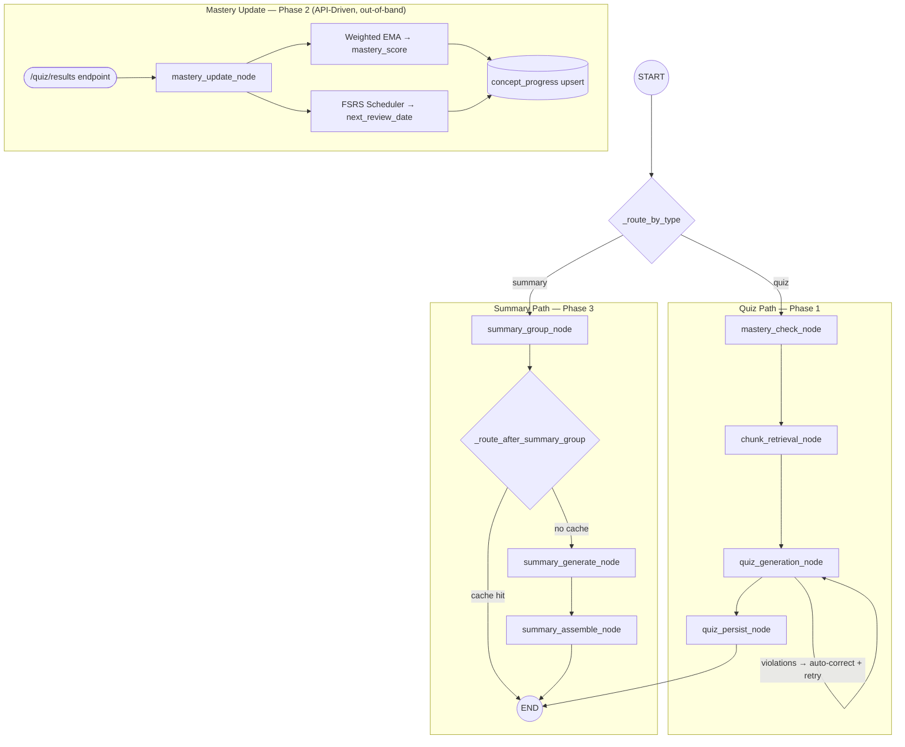

# RAG Agent Architecture and Flow
This document details the architecture and execution flow for the Retrieval-Augmented Generation (RAG) agent within the FYP AI Academic Assistant's AI Service. 

Based on LangGraph, the RAG agent handles two core request types corresponding to major features of the platform: 
1. **Quiz Generation** (`request_type: "quiz"`)
2. **Summary Generation** (`request_type: "summary"`)

The architecture also encompasses post-quiz mastery updates involving Free Spaced Repetition Scheduling (FSRS) and Weighted Exponential Moving Average (EMA).

---

## 1. State Schema (`RAGState`)
The agent shares data across nodes using a TypedDict `RAGState`. 

- **Inputs**: `request_type`, `user_id`, `subject_id`, `topic_name` (optional for mindmaps), `target_count` (quiz-specific, length of the quiz).
- **Quiz Path Intermediates**: `course_id`, `concept_stats` (mastery per concept), `context_blocks` (text chunks, mastery, and difficulty per concept).
- **Summary Path Intermediates**: `concept_groups` (thematic clusters of concepts), `group_results` (prose and code for visuals per group).
- **Outputs**: `result` (final generated object), `quiz_id` (post-persistence reference), `error`.

---

## 2. Graph Control Flow

The graph supports two independent request paths, selected at the conditional entry point. The mastery update pathway is API-driven and operates fully outside the LangGraph state machine.

### Execution Pattern

1. **Quiz path (sequential):** `mastery_check` → `chunk_retrieval` → `quiz_generation` → `quiz_persist`. The `quiz_generation` node includes a self-loop: on business rule violations it appends its own output as `AIMessage` and retries once before raising.
2. **Summary path (conditional short-circuit):** `summary_group` checks the `course_topics.summary` cache first. On a hit, the conditional edge routes directly to `END`. On a miss, it proceeds to `summary_generate` → `summary_assemble`. Within `summary_generate`, per-group `_explain_group` and `_visual_group` calls run concurrently via `asyncio.gather`.
3. **Mastery update (out-of-band):** Triggered by the `/quiz/results` FastAPI endpoint after the user submits quiz answers. Runs `mastery_update_node` directly — not wired into the LangGraph state machine — and upserts weighted EMA mastery scores and FSRS scheduling fields into `concept_progress`.

---

## 3. Execution Routing
At the entry point of the LangGraph state machine, the Conditional Entry Point `_route_by_type` evaluates `state["request_type"]`:
* If `"quiz"`, it branches to **`mastery_check`**.
* If `"summary"`, it branches to **`summary_group`**.

---

## 4. Quiz Generation Flow (Phase 1)
This path generates highly target adaptive multiple-choice quizzes designed around the user's specific mastery levels on fundamental concepts.

### Node 1: `mastery_check_node`
- **Purpose**: Map out the learning topology and current user proficiency.
- **Process**:
  1. Identifies the `course_id` linked to the current `subject_id`.
  2. Queries `learning_chunks` for an ordered set of unique concepts under the given `topic_name`.
  3. Queries `concept_progress` to retrieve the current user's `mastery_score` for all identified concepts.
  4. Returns `concept_stats` providing a dictionary mapping all concepts to a score (defaulting to 0 for unassessed concepts).

### Node 2: `chunk_retrieval_node`
- **Purpose**: Fetch educational context data limits to ground the LLM's quiz content.
- **Process**:
  1. Iterates over concepts identified in `concept_stats`.
  2. Retrieves `chunk_text` and `difficulty_tier` from `learning_chunks`.
  3. Concatenates all chunks relating to the same concept.
  4. Returns `context_blocks` (a formatted array containing `concept_name`, `chunk_text`, `mastery_score`, and `difficulty_tier`).

### Node 3: `quiz_generation_node`
- **Purpose**: LLM invocation to build adaptive assessment questions with stringent structure.
- **Process**:
  1. Prepares a prompt grounding the `gemini-2.5-pro` model with system rules and user context blocks.
  2. Utilizes a **3-Phase Chain of Thought (CoT)** approach:
     - Phase 1: Capacity/allocation analysis based on provided priorities.
     - Phase 2: Question outline.
     - Phase 3: Final JSON generation of the questions.
  3. **Strict Validation**: Evaluates the output against business rules via `_validate_quiz` (exactly 4 options, exactly 1 correct true option, no empty hints or rationales, exact matches for valid `topic` names).
  4. **Auto-correction Loop**: If rules are violated, an error is logged. The model is presented its prior attempt as an `AIMessage` against an inline `HumanMessage` specifying what violated the rules, prompting an immediate local regeneration attempt.
  5. Output is wrapped into `state["result"]`. (The CoT `reasoning` is purposefully preserved in the payload for debugging but ignored by the frontend).

### Node 4: `quiz_persist_node`
- **Purpose**: Store the created artifact to the DB.
- **Process**:
  1. Inserts the JSON wrapper into the `quizzes` table under a `status: "pending"`.
  2. Returns the generated UUID/integer `quiz_id` into the LangGraph state.
  3. The node completes and reaches LangGraph's `END`.

---

## 5. Mastery Update Pathway (Phase 2 - API Driven)
While not directly embedded in LangGraph's synchronous node path, quiz consumption invokes `mastery_update_node` asynchronously when the frontend submits test answers back to `/quiz/results` API.

**Process**:
1. **Resolution:** Compares incoming answers (containing user selection, `hint_used`, & `not_sure` flags) against the ground-truth `quiz_json` stored within the `quizzes` table. Maps each answer strictly back to its relative `concept_name` and determines correctness.
2. **Mastery Scoring (Weighted EMA):** 
   - A `weighted_score` calculation applies penalties against the BKT (Baker et al.) rule: Use of a hint bypasses unaided retrieval (`hint=True & unsure=True -> 0.2`, `hint=True -> 0.3`, `unsure=True -> 0.4`, standard correct `1.0`). Incorrect answers award `0.0`.
   - A batch update processes all concepts inside the quiz test.
   - Traditional Mastery Score moves towards the new weighted performance: `New Mastery = Round(0.8 * Old + 0.2 * Current Test Percentage)`.
3. **FSRS Scheduling:**
   - Interprets `weighted_score` into spaced repetition categorical boundaries (`[<0.4 = Again, >=0.4 = Hard, >=0.6 = Good, >=0.8 = Easy]`).
   - Interfaces directly with a module-level `FSRS Scheduler` singleton to shift the `Card`'s `stability`, `difficulty`, `state`, and `step` values. Predicts the optimal `next_review_date`.
4. Upserts this progression payload back into `concept_progress`.

---

## 6. Summary Generation Flow (Phase 3)
This path collapses broad topic texts into visually grounded, clustered overviews. 

### Node 1: `summary_group_node`
- **Purpose**: Check Cache or Group existing concepts.
- **Process**:
  1. **Cache Routing**: Seeks out `course_topics.summary` to identify if a completed cache iteration of this specific topic exists. If cached, routes immediately to `END` natively via LangGraph conditional edges (`_route_after_summary_group`).
  2. Retrieves ordered unique concepts belonging to the topic.
  3. Uses `gemini-3-flash-preview` to cluster concepts thematically, returning `group_title`, associated `concept_names`, a prescribed `explanation_style`, and a boolean `needs_visual`.

### Node 2: `summary_generate_node`
- **Purpose**: Concurrency Generation of Text and Code.
- **Process**:
  1. Aggregates all text chunk databases for caching efficiency locally to omit repeated iterative Database fetch blocks.
  2. Uses Python's `asyncio.gather` for highly concurrent processing:
     - Iterates each matched group array.
     - **Always Runs:** `_explain_group` executes `gemini-2.5-pro` prompting an orienting sentence prose strict to an `explanation_style`. 
     - **Conditionally Runs:** If the group specifies `needs_visual`, concurrently runs `_visual_group` via `gemini-3-flash-preview` instructing standard decision-gate creation toward Markdown Tables or Mermaid syntax logic.
  3. Returns isolated payloads of text + visual codes inside `group_results`.

### Node 3: `summary_assemble_node`
- **Purpose**: Compile string segments into unified markdown output.
- **Process**:
  1. Iterates the results from Node 2.
  2. **Validation Safeguards**: Scans Mermaid visual block entries; checks the starter syntax (`graph`, `flowchart`, `gantt`, etc.). If invalid, silently drops the block instead of crashing the summary context.
  3. Joins the results through thematic separated Markdown structures (`## {title}`, `{text}`, `{mermaid_block}`, horizontal dividers `---`).
  4. Pushes `summary_markdown` up through the `course_topics.summary` Database table natively locking the topic cache.
  5. Returns target Markdown result & hits LangGraph `END`.