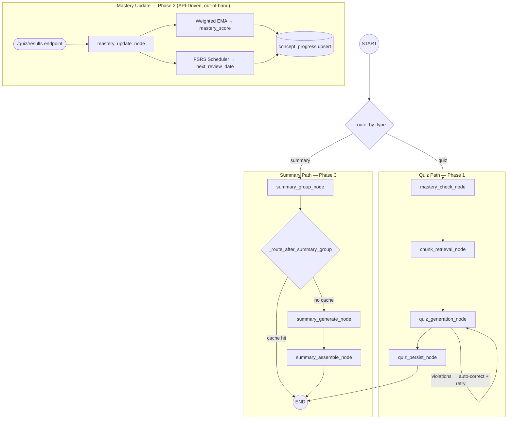

---

## RAG Agent
Generates topic-adaptive quizzes and concept summaries from course materials, using each student's current mastery scores to target weak areas and calibrate question difficulty.

```mermaid
graph TD
    START((START))

    START --> ROUTE{_route_by_type}
    ROUTE -->|quiz| mastery_check[mastery_check_node]
    ROUTE -->|summary| summary_group[summary_group_node]

    subgraph quiz_path ["Quiz Path — Phase 1"]
        mastery_check --> chunk_retrieval[chunk_retrieval_node]
        chunk_retrieval --> quiz_generation[quiz_generation_node]
        quiz_generation -->|"violations → auto-correct + retry"| quiz_generation
        quiz_generation --> quiz_persist[quiz_persist_node]
    end

    quiz_persist --> END((END))

    subgraph summary_path ["Summary Path — Phase 3"]
        summary_group --> CACHE{_route_after_summary_group}
        CACHE -->|cache hit| END
        CACHE -->|no cache| summary_generate[summary_generate_node]
        summary_generate --> summary_assemble[summary_assemble_node]
    end

    summary_assemble --> END

    subgraph mastery_path ["Mastery Update — Phase 2 (API-Driven, out-of-band)"]
        RESULTS(["/quiz/results endpoint"]) --> mastery_update[mastery_update_node]
        mastery_update --> weighted_ema["Weighted EMA → mastery_score"]
        mastery_update --> fsrs_update["FSRS Scheduler → next_review_date"]
        weighted_ema --> cp[(concept_progress upsert)]
        fsrs_update --> cp
    end
```

## How it works

### Quiz path
1. **Mastery check** — Reads the student's `concept_progress` scores to identify weak areas and allocate question slots by mastery weight.
2. **Chunk retrieval** — Fetches relevant learning chunks for the targeted concepts.
3. **Quiz generation** — 3-phase Chain-of-Thought: allocate question slots by mastery → outline questions → generate final JSON. A self-correcting loop retries if structural constraints (exactly 4 options, exactly 1 correct answer) are violated.
4. **Persist** — Saves the generated quiz to the DB.

### Mastery update (out-of-band)
Triggered by the `/quiz/results` endpoint after the user submits answers. Runs Weighted EMA on the score and FSRS scheduling to compute `next_review_date`, then upserts `concept_progress`. Runs independently of quiz generation so quiz creation never blocks on user response time.

### Summary path
1. **Cache check** — Routes directly to END on a `course_topics.summary` hit.
2. **Generate** — On cache miss, `asyncio.gather` runs prose and visual/code generation in parallel per concept group.
3. **Assemble** — Merges and persists the generated summaries.

## Key Engineering Decisions

### Mastery-weighted question allocation
A flat quiz prompt wastes questions on already-mastered concepts. The 3-phase CoT first allocates question slots by mastery score, then generates final JSON with a built-in self-correcting loop enforcing structural constraints (exactly 4 options, exactly 1 correct answer).

### Out-of-band mastery update
Running FSRS and EMA recalculation inside the quiz generation graph would block until the user submits answers — potentially hours later. Keeping it as a separate `/quiz/results` endpoint means quiz creation completes synchronously while mastery updates run asynchronously.

### Cache-first summary routing
Summaries are expensive to regenerate but rarely change between ingestion cycles. A cache hit on `course_topics.summary` routes directly to END. On a miss, `asyncio.gather` across concept groups keeps generation fast by running LLM calls in parallel.

---
