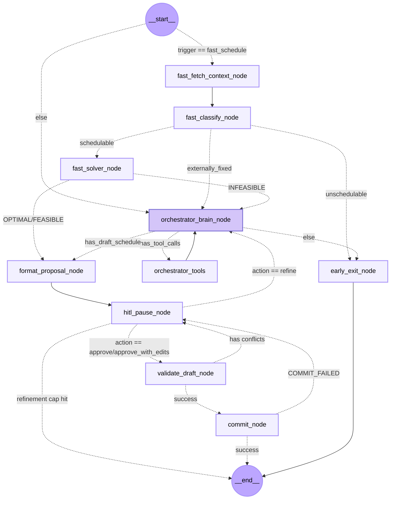

# Scheduler Agent Graph — Comprehensive Architecture Guide

## Overview

The **Scheduler Agent Graph** is an advanced, interruptible LangGraph state machine designed for both single-event "fast scheduling" and complex, multi-task orchestration. It combines constraint programming (Google OR-Tools CP-SAT), AI reasoning (Google Gemini 2.5 Pro), and human-in-the-loop validation to produce optimal, feasible study schedules that respect user preferences, deadlines, and calendar constraints.

**Core Features:**
- **Dual-path routing**: Fast path for simple events, LLM orchestration for complex scenarios
- **3-pass constraint relaxation**: Progressively soften constraints to escape infeasibility
- **HITL interrupts**: Pause before commit for human review and refinement
- **ReAct reasoning loop**: LLM controls tool invocations via explicit reasoning protocol
- **Decomposition caching**: Sub-session breakdowns are cached and reused across solver calls
- **Trigger-aware workflows**: Different entry logic for lms_import, ai_decompose, missed_event, conflict_resolution, etc.

---

## Why LangGraph Visualization Failed

In LangGraph, conditional edges can route at runtime based on string returns without an explicit path-mapping dictionary. However, **static visualization (like `draw_mermaid()`) cannot execute conditional logic** to infer return values. Since `scheduler/graph.py` uses dynamic routing functions without mapping dictionaries, the Mermaid generator cannot determine where edges point, resulting in isolated nodes.

---

## Manual Mermaid Graph



---

## Detailed Architecture & Flow

### 1. Dual Entry Points via `_entry_router`

The graph's entry point inspects the `trigger_type` parameter in the state:

- **`trigger_type == "fast_schedule"`** → Routes to **fast path** (fast_fetch_context_node)
  - Used for single calendar events or simple items where no LLM reasoning is needed
  - Bypasses LLM overhead, reads calendar, classifies, solves

- **Any other trigger_type** → Routes to **orchestrator path** (orchestrator_brain_node)
  - Used for complex tasks requiring decomposition, conflict resolution, refinement
  - Trigger types: `ai_decompose`, `lms_import`, `missed_event`, `conflict_resolution`, `deadline_changed`, `conversational_refinement`

---

### 2. Fast Path: Rapid Single-Event Scheduling

For simple events or tasks, the fast path performs an optimized pipeline:

#### **`fast_fetch_context_node`** (Pure Python)
**Purpose:** Synchronously fetch all calendar context data without LLM.

**Inputs from state:**
- `user_id`: User identifier
- `user_timezone`: IANA timezone (e.g., "Asia/Kolkata")
- `target_items`: List of items to schedule (typically 1 for fast_schedule)

**Processing:**
1. Calls `fetch_calendar_context()`, which queries Supabase for:
   - User work preferences (work_slots, default_session_min from user_preferences)
   - Historical analytics (preferred_slots, avoid_slots from user_preferences_analytics)
   - Fixed calendar events (is_fixed=true, status in [scheduled, in_progress])
   - Non-fixed calendar events (is_fixed=false, can be displaced in Pass 3)
   - Routines and their recurrence materializations over the 28-day window
   - Parent task deadlines (if any non-fixed events are children of tasks)
2. Expands work_slot definitions into slot pairs over the scheduling window
3. Materializes routine occurrences (recurrence patterns) into fixed and soft blocks

**Output to state:**
```python
{
  "calendar_context": CalendarContext {
    work_slots: list[WorkSlot],
    default_session_min: int,
    preferred_slots: list[dict],
    avoid_slots: list[dict],
    fixed_blocks: list[FixedBlock],         # Hard walls (always)
    non_fixed_event_blocks: list[FixedBlock],  # Can be soft in Pass 3
    soft_blocks: list[FixedBlock],          # Soft walls (routines)
    work_slot_pairs: list[tuple[int, int]],  # Expanded windows in slots
    window_start: str,  # ISO datetime (UTC)
    window_end: str,    # ISO datetime (UTC)
    user_timezone: str
  }
}
```

**Notes:**
- **Slot unit**: 30 minutes (SLOT_MINUTES = 30)
- **Window**: Always 28 days from now, UTC-based with timezone conversions on edges
- **Fixed blocks**: is_fixed=true events + materialized routine occurrences
- **Non-fixed blocks**: is_fixed=false calendar events (can be rescheduled)
- **Parent deadline tracking**: Fetched for Pass 3 displacement penalties

---

#### **`fast_classify_node`** (Hybrid: Deterministic + Optional LLM)
**Purpose:** Quickly classify if the target item is schedulable, externally fixed, or unschedulable.

**Deterministic pre-classification:**
- If `type == "event"` (user calendar entry) → Always **schedulable**
- If `event_type` in {class, assessment, exam, lecture, tutorial, lab} → **externally_fixed**
- If title starts with {study, prepare, revise, review, practice, work on, read} → **schedulable** (study intent overrides keywords)
- If title contains keywords {exam, lecture, meeting, appointment} → **externally_fixed**
- If title contains errand keywords {buy, groceries, haircut, call mom, dentist} → **unschedulable**
- Otherwise → Defer to LLM

**LLM invocation** (Gemini 3 Flash, Prompt #1: CRAFT + Few-Shot):
- Invoked only for ambiguous entries
- Outputs binary JSON: `{"schedulable": true/false, "reason": "..."}`

**Output to state:**
```python
{
  "target_items": [  # Updated with classification result
    {
      ...original item...,
      "_classify_result": {
        "schedulable": bool,
        "reason": str  # "externally_fixed", "unschedulable", etc.
      }
    }
  ]
}
```

**Router decision** via `_fast_classify_router`:
- `schedulable: true` → fast_solver_node
- `reason: "externally_fixed"` → orchestrator_brain_node (conflict resolution path)
- Otherwise (unschedulable) → early_exit_node

---

#### **`fast_solver_node`** (Pure Python + CP-SAT)
**Purpose:** Run the constraint solver to place the event into the user's calendar.

**Key constraint:**
- The new event is placed as a **hard wall** — existing events remain immobile
- Solver maximizes fit within work_slots, preferred_slots, and around fixed blocks

**Processing:**
1. Reads `calendar_context` and `target_items` from state
2. Converts each target item into a `SolverTask` (with 1 session by default for fast path)
3. Invokes `run_ortools_solver()` with pass_number=1
4. On **FEASIBLE/OPTIMAL**: Draft schedule is populated; proceeds to format_proposal_node
5. On **INFEASIBLE**: Handoff to orchestrator with `handoff_reason: "fast_infeasible"`

**Output to state:**
```python
# On FEASIBLE/OPTIMAL:
{
  "draft_schedule": list[DraftSession],
  "solver_status": "OPTIMAL" | "FEASIBLE",
  "conflicts": [],
  "warnings": list[str]  # e.g., "Session placed outside preferred hours"
}

# On INFEASIBLE:
{
  "solver_status": "INFEASIBLE",
  "conflicts": [...infeasibility reasons...],
  "handoff_reason": "fast_infeasible",  # Triggers orch_brain path
  "draft_schedule": []  # Cleared; orchestrator will retry
}
```

---

#### **`early_exit_node`** (Terminal)
**Purpose:** Exit gracefully when no schedule is possible (unschedulable item).

**Sets state:**
```python
{
  "solver_status": "UNSCHEDULABLE",
  "draft_schedule": []  # No schedule created
}
```

Routes to END, user receives error message via backend.

---

### 3. Complex Path: LLM Orchestrator with Tool-Calling Loop

For multi-task scheduling, conflict resolution, or fast-path failures, the orchestrator brain drives a multi-turn ReAct loop.

#### **State: `SchedulerState` Persistence**

The state object tracks the entire scheduling session and is persisted in LangGraph checkpointer:

```python
class SchedulerState(TypedDict):
    # ── Core messaging ──────────────────────────────────────────────
    messages: Annotated[list, add_messages]  # LangGraph message history
    
    # ── Session identity (injected on invoke, persisted across turns) ──
    user_id: str
    thread_id: str
    session_expires_at: str  # ISO datetime (UTC), 48-hour TTL
    refinement_count: int    # Max 5 cycles; cap hit → END
    
    # ── Routing & flow control ──────────────────────────────────────
    trigger_type: str  # "fast_schedule" | "ai_decompose" | "lms_import" 
                       # | "missed_event" | "conflict_resolution" 
                       # | "deadline_changed" | "conversational_refinement"
    handoff_reason: Optional[str]  # Set when fast path hands off 
                                    # (e.g., "fast_infeasible")
    target_items: list[dict]  # Tasks + assessment events to schedule
    
    # ── Solver inputs ───────────────────────────────────────────────
    calendar_context: CalendarContext  # Fetched by fetch_context tool
    decomposed_sessions: dict[str, list[dict]]  # Cache: item_id → sessions
                                                # Persists across solver retries
    
    # ── Solver outputs ──────────────────────────────────────────────
    draft_schedule: list[DraftSession]  # Final placements (ISO datetimes)
    draft_id: str  # UUID for idempotent commit
    conflicts: list[str]  # Infeasibility reasons, conflict flags
    warnings: list[str]  # Non-blocking warnings ("session outside preferred hours")
    compromise_notes: list[str]  # Human-readable applied compromises shown at HITL
    
    # ── Solver status ───────────────────────────────────────────────
    solver_status: str  # "OPTIMAL" | "FEASIBLE" | "INFEASIBLE" 
                        # | "PENDING" | "UNSCHEDULABLE" | "COMMITTED"
    
    # ── HITL & refinement ───────────────────────────────────────────
    _resume_action: Optional[str]  # Injected on resume: "approve" | 
                                    # "approve_with_edits" | "refine"
    user_timezone: str  # IANA timezone from request
    
    # ── Auto-approve (Agent 1 lms_import path) ──────────────────────
    auto_approve: bool  # If True, HITL pause is bypassed
    _hitl_auto_approved: bool  # Set True after first auto-approve; 
                                # prevents retry loop
```

---

#### **`orchestrator_brain_node`** (Gemini 2.5 Pro with Tool Binding)
**Purpose:** Drive the tool-calling loop via LLM reasoning.

**Prompt Framework:** ReAct (Prompt #4)
- **System prompt** (dynamic): Built per trigger_type with numbered steps and tool descriptions
- **Trigger blocks**: Each trigger type (ai_decompose, lms_import, missed_event, etc.) has explicit sequenced steps
- **Dependency chain**: Tools must be called in order; LLM must not skip steps
- **Hard rules**: No timestamps in propose_compromise calls, always attempt compromise before INFEASIBLE exit

**Reasoning Protocol (embedded in system prompt):**
1. Before each tool call: Identify missing information in state
2. Choose lowest-cost tool: READ before COMPUTE
3. After each result: Ask "Is draft_schedule complete and FEASIBLE?"
4. If INFEASIBLE: Call propose_compromise, apply directives, re-solve (never give up)
5. Tool turn cap: Max 10 tool turns; if exceeded, return best available and flag in conflicts

**Trigger-specific behavior:**

| Trigger | Entry Steps | Special Notes |
|---------|------------|---------------|
| **ai_decompose** | 1. fetch_calendar_context 2. decompose_task 3. run_solver 4. propose_compromise if INFEASIBLE | Standard multi-task flow |
| **lms_import** | 1. fetch_calendar_context 2. decompose_task 3. run_solver 4. propose_compromise if INFEASIBLE | Same as ai_decompose; may auto-approve |
| **missed_event** | 1. fetch_calendar_context 2. evaluate_rules_tool 3. Handle response (placed / needs_recalc / deadline_passed / no_action) | Special rescue heuristic for rescheduled sessions |
| **conflict_resolution** | Partially deferred (Open Question) | Handle fixed event vs. non-fixed event conflicts |
| **deadline_changed** | 1. fetch_calendar_context 2. Identify affected items 3. run_solver for affected sessions 4. propose_compromise if INFEASIBLE | Partial re-solve; only sessions before new deadline |
| **conversational_refinement** | 1. fetch_calendar_context 2. Classify user request (duration/breakdown/slot change) 3. Apply updates 4. run_solver 5. propose_compromise if INFEASIBLE | User-driven adjustments via chat |

**First call vs. subsequent calls:**
- **First call (no SystemMessage in history):** Prepend system prompt + state context to messages, append synthetic human message describing the scheduling request
- **Fresh refine cycle (last message is HumanMessage after system exists):** Clear stale tool history, rebuild system prompt with updated state, resume
- **Tool-calling loop iteration (last message is ToolMessage):** Invoke LLM with full history; no system prompt re-prepend

**Output to state:**
- Tool invocations → `messages` list gets ToolMessage with tool ID and results
- LLM response gets appended with tool_calls if present
- Router checks: Does response have tool_calls? Is draft_schedule populated?

---

#### **`orchestrator_tools`** (LangGraph ToolNode)
**Purpose:** Execute LLM-requested tool calls and append results to messages.

The tool node is a thin wrapper around 6 specialized tools:

---

### 4. Specialized Tools

#### **`fetch_calendar_context_tool`** (READ) 
**Args:** (state: InjectedState) → returns JSON string

**What it does:** Calls `fetch_calendar_context()` which:
1. Queries user_preferences (work_slots, default_session_min)
2. Queries user_preferences_analytics (preferred_slots, avoid_slots)
3. Fetches fixed calendar events (is_fixed=true)
4. Fetches non-fixed calendar events (is_fixed=false) + parent deadlines
5. Fetches and materializes routines over the window
6. Expands work slots into (start_slot, end_slot) pairs
7. Returns fully populated CalendarContext

**Cost:** 1 DB round-trip; cached if already in state (LLM can skip)

**Dependency:** Should be called first; enables all downstream tools

---

#### **`decompose_task_tool`** (COMPUTE)
**Args:** (state, item_index: int = 0, force_redecompose: bool = False) → returns JSON list of sessions

**What it does:**
1. Looks up target_items[item_index]
2. **Cache check**: Returns cached decomposed_sessions[item_id] if found and force_redecompose=False
3. **LLM call** (Gemini 3 Flash, Prompt #2: CRAFT + Few-Shot):
   - Receives task title, estimated_effort (minutes), deadline info, subject
   - Outputs JSON list of sub-sessions with duration_min, session_label, ordering flags
   - Respects default_session_min from calendar_context (min 60 min per session)
   - Generates up to 8 sessions per task (MAX_SESSIONS = 8)
4. Stores result in decomposed_sessions cache

**Output format:**
```json
[
  {
    "id": "session-uuid-0",
    "duration_min": 120,
    "session_label": "Drafting",
    "ordered": false
  },
  {
    "id": "session-uuid-1",
    "duration_min": 60,
    "session_label": "Review",
    "ordered": true  // Must follow session-uuid-0
  }
]
```

**Caching:** 
- Cached per item_id
- **NOT** re-decomposed if force_redecompose=False and entry exists
- force_redecompose=True only when user explicitly requests different breakdown
- Cleared on INFEASIBLE/UNSCHEDULABLE when refinement restarts

---

#### **`patch_decomposed_session_tool`** (WRITE)
**Args:** (state, item_index: int, session_label: str, new_duration_min: int) → returns JSON

**What it does:**
1. Finds decomposed_sessions[item_id]
2. Matches session by label (case-insensitive substring match)
3. Updates duration_min and duration_slots (computed as duration_min / SLOT_MINUTES)
4. **Does NOT re-decompose** — preserves other sessions

**Use case:** User says "Make the first session 1 hour" or "Extend the review phase by 30 min"

**Why separate from decompose_task:**
- Session-level duration tweaks don't require LLM re-reasoning
- Avoids redundant decomposition LLM call
- Preserves LLM-generated labels and ordering

---

#### **`evaluate_rules_tool`** (HEURISTIC)
**Args:** (state: InjectedState) → returns JSON Command with "placed" | "needs_full_recalculation" | "deadline_passed" | "no_action_needed"

**What it does (missed_event trigger ONLY):**
1. Receives session that was missed (didn't execute at scheduled time)
2. Applies fast heuristics:
   - If missed < 24 hours ago and duration ≤ 60 min (2 slots) → Try to place immediately in next available gap (MAX_QUICK_RESCUE_SLOTS = 2)
   - If deadline has passed → Return "deadline_passed" (no reschedule)
   - If no quick gap exists → Return "needs_full_recalculation" (escalate to orchestrator)
   - If session already in calendar → Return "no_action_needed"
3. If "placed": Directly writes to draft_schedule; orchestrator can skip to format_proposal

**Output:**
```json
{
  "status": "placed" | "needs_full_recalculation" | "deadline_passed" | "no_action_needed",
  "message": "...",
  "draft_sessions": [...] // only if status == "placed"
}
```

**Note:** Bypasses full solver for quick rescue; if fails, orchestrator does full re-solve

---

#### **`run_ortools_solver_tool`** (COMPUTE)
**Args:** (state: InjectedState) → returns JSON Command with solver result

**What it does:**
1. Reads calendar_context (from state or from messages if orchestrator path)
2. Reads decomposed_sessions and target_items
3. Builds SolverInput:
   ```python
   @dataclass
   class SolverInput:
       tasks: list[SolverTask]  # Each with session_ids, durations, priority, deadline_slot
       fixed_blocks: list[tuple[int, int]]  # Hard walls (always)
       non_fixed_event_blocks: list[tuple[int, int, Optional[int]]]  # (start, end, parent_deadline_slot)
       soft_blocks: list[tuple[int, int]]  # Routines (soft penalty)
       work_slot_pairs: list[tuple[int, int]]  # User work windows
       window_size_slots: int
       now_slot: int  # Current time
       preferred_slots: list[tuple[int, int]]  # Soft bonuses
       avoid_slots: list[tuple[int, int]]  # Soft penalties
       pass_number: int  # 1 / 2 / 3
   ```
4. Calls `solve_with_relaxation()` which runs Pass 1 → Pass 2 → Pass 3 as needed
5. Returns SolverResult with status, draft_sessions, conflicts, warnings

---

### 5. The 3-Pass Constraint Relaxation Strategy

When the solver returns INFEASIBLE, the orchestrator automatically retries with progressively relaxed constraints. This is the **solve_with_relaxation** strategy:

**Pass 1: Strict mode**
- work_slots: **HARD** (all sessions must fit within defined work windows)
- non_fixed_event_blocks: **HARD** (no displacement of is_fixed=false events)
- Skipped if user has no work_slots defined (new user)

**Pass 2: Soften work windows**
- work_slots: **SOFT** (penalty 500 per violation)
- non_fixed_event_blocks: **HARD** (still no displacement)
- Allows sessions outside user's preferred work hours if necessary

**Pass 3: Displace events**
- work_slots: **SOFT** (penalty 500)
- non_fixed_event_blocks: **SOFT** (penalty 80, or 400 if parent deadline urgent)
- Allows rescheduling of existing non-fixed events (with penalties)
- Parent-aware penalties: If displaced event's parent task deadline is ≤7 days away, penalty = 400 (URGENT) else 80

**Penalty hierarchy (all per-slot violation):**
```
WORK_SLOT_VIOLATION_PENALTY = 500       # Scheduling outside work hours
URGENT_PARENT_DISPLACEMENT_PENALTY = 400  # Displacing child of urgent task
NON_FIXED_EVENT_DISPLACEMENT_PENALTY = 80  # Displacing regular non-fixed event
SOFT_ROUTINE_PENALTY = 50                # Soft routines (rrule-based)
AVOID_SLOT_PENALTY = 10                  # User-marked avoid times
PREFERRED_SLOT_BONUS = 1                 # User-marked preferred times (-1, subtracted)
EARLINESS_WEIGHT = 1                     # Tiebreaker: prefer early times
```

**Constraint logic in CP-SAT model:**
1. **Deadline constraints**: Sessions must end by deadline_slot (hard if Pass 1+, soft lateness penalty if earlier passes)
2. **Session duration**: Each session must fit in duration_slots
3. **No-overlap buffers**: 30-min (MIN_BUFFER_SLOTS = 1) gap between consecutive sessions
4. **Subject balance**: Max 2 hours (4 slots) consecutive study for same subject
5. **Session ordering**: If session[i].ordered=true, then session[i] must start after session[i-1] ends
6. **Sleep blocks**: Hard walls 11pm–8am unless overridden by user work_slots

**Exit strategy:**
- If Pass 1 INFEASIBLE → Try Pass 2
- If Pass 2 INFEASIBLE → Try Pass 3
- If Pass 3 INFEASIBLE → Call propose_compromise_tool to manually shrink/postpone/drop tasks
- If compromise + Pass 3 still INFEASIBLE (or max compromise rounds exceeded) → Return UNSCHEDULABLE

---

#### **`propose_compromise_tool`** (COMPUTE)
**Args:** (state: InjectedState) → returns JSON Command; mutates target_items and decomposed_sessions

**What it does:**
1. Analyzes conflict reasons from INFEASIBLE result
2. **LLM decision** (Gemini 2.5 Pro): Suggests 1-3 compromise directives:
   ```json
   [
     {
       "type": "shrink",  // Reduce duration
       "item_id": "task:abc-123",
       "total_reduction_min": 60  // Remove 60 min from the task
     },
     {
       "type": "postpone",  // Delay start
       "item_id": "task:def-456",
       "postpone_days": 2  // Move to 2 days later
     },
     {
       "type": "drop",  // Remove entirely
       "item_id": "task:ghi-789"
     }
   ]
   ```
3. **Applies directives inline:**
   - Shrink: Trims sessions from the end (last session first, then partial trim)
   - Postpone: Updates deadline_slot to future date
   - Drop: Removes item from target_items and decomposed_sessions
4. **Returns human-readable notes** for display at HITL:
   - "Reduced 'Study for finals' from 10 hours to 8 hours"
   - "Moved 'CS Project' start to 2 days later"
   - "Dropped 'Optional review' to make room"

**Critical design rule:** 
- **No timestamps or absolute dates in directives** — the solver interprets all inputs as abstract slot deltas
- Absolute dates corrupt the slot-based arithmetic and lead to overlap bugs
- LLM must think in terms of "reduce by X minutes" not "move to next Tuesday"

---

### 6. Human-In-The-Loop (HITL) Flow

#### **`format_proposal_node`** (Pure Python)
**Purpose:** Normalize draft_schedule and prepare for human review.

**Processing:**
1. Generates unique draft_id (UUID)
2. Sets session_expires_at (48 hours TTL)
3. Normalizes all DraftSession objects to ensure fields present
4. Counts sessions for logging

**Output to state:**
```python
{
  "draft_schedule": [  # Normalized
    {
      "task_id": Optional[int],
      "parent_event_id": Optional[int],  # For assessment prep events
      "title": str,
      "start_time": str,  # ISO datetime (UTC)
      "end_time": str,    # ISO datetime (UTC)
      "subject_id": Optional[int],
      "session_label": str  # e.g. "Part 1 of 3"
    },
    ...
  ],
  "draft_id": str,  # UUID
  "session_expires_at": str  # ISO datetime (UTC)
}
```

---

#### **`hitl_pause_node`** (Interrupt + Resume Handler)
**Purpose:** Halt graph execution before commit, allow human review/refinement.

**Interrupt:** Graph pauses here (interrupt_before=["hitl_pause_node"]) and waits for external resume signal.

**Auto-approve bypass (Agent 1 lms_import):**
- If `auto_approve=True` AND `_hitl_auto_approved=False`:
  - Automatically inject `_resume_action: "approve"` and flag `_hitl_auto_approved: True`
  - Continues without human wait
  - On commit failure, graph re-enters HITL; _hitl_auto_approved is True, so now manual HITL is shown

**Resume actions** (injected via /resume endpoint):**

| Action | Behavior | Next Node |
|--------|----------|-----------|
| **approve** | Accept schedule as-is | validate_draft_node |
| **approve_with_edits** | Accept; edits payload merged into draft | validate_draft_node |
| **refine** | Bounce back to orchestrator with user critique | orchestrator_brain_node (trigger_type = conversational_refinement) |

**Refine logic:**
- Increments refinement_count
- If refinement_count >= MAX_HITL_REFINE_CYCLES (5): Return "Max refinements reached" and END
- Else: Clears draft_schedule, resets solver_status to PENDING, clears decomposed_sessions if last pass was INFEASIBLE
- Appends user message to messages list
- Routes back to orchestrator_brain_node with fresh state snapshot

---

#### **`validate_draft_node`** (Safety Net)
**Purpose:** Final re-check before commit; catches approval errors.

**Processing:**
1. **Verify session TTL:** Check scheduler_sessions table; if expired, return UNSCHEDULABLE
2. **Re-materialize fixed walls:** Re-fetch fixed events + routines from DB (in case DB changed since fetch_context)
3. **Overlap detection:** Check if any draft_session overlaps with fresh fixed_walls
4. **Non-fixed event soft check:** Warn if draft_session overlaps non-fixed events (not hard error, just logged)
5. **Parent reference verification:** Ensure all task_id and parent_event_id refs still exist in DB

**Output to state:**
- If conflicts found: `{"conflicts": ["overlap detected with event X", ...]}`
- Else: `{"conflicts": []}`

**Router:**
- If conflicts: Route back to hitl_pause_node (so user sees error and can refine)
- Else: Route to commit_node

---

#### **`commit_node`** (Atomic Write)
**Purpose:** Atomically write all draft sessions to Supabase and persist.

**Processing:**
1. Calls `commit_schedule_to_db()` which invokes RPC `commit_draft_schedule`:
   - Verifies draft_id matches a pending draft in db
   - Inserts all draft_sessions as calendar_events (status=scheduled, is_fixed=false initially)
   - Atomically clears the draft from scheduler_sessions
   - Returns success or error

**Output to state:**
- If success: `{"solver_status": "COMMITTED"}`
- If failure: `{"conflicts": ["COMMIT_FAILED: <error reason>"]}`

**Router:**
- If COMMIT_FAILED: Back to hitl_pause_node (user sees error, can retry)
- Else: END (success)

---

### 7. State Type Definitions

#### **`SolverTask`** (passed to solver)
```python
@dataclass
class SolverTask:
    id: str                                    # "task:<uuid>" | "event:<uuid>"
    deadline_slot: Optional[int]               # None if no deadline
    priority_weight: int                       # high=3, medium=2, low=1
    subject_id: Optional[int]
    session_ids: list[str]                     # Ordered decomposed session IDs
    session_durations: list[int]               # Duration in slots (parallel array)
    sessions_ordered: bool                     # True if order must be preserved
    earliest_start_slot: Optional[int]         # None unless explicitly set (e.g., post-lecture consolidation)
    session_title: str = ""                    # e.g. "Study for finals"
    session_labels: list = None                # Per-session labels, e.g. ["Drafting", "Review"]
    session_ordered_flags: list = None         # Per-session ordering: flags[i]=True → session i must follow i-1
```

#### **`DraftSession`** (output to calendar)
```python
class DraftSession(TypedDict):
    task_id: Optional[int]                     # NULL if prep for assessment
    parent_event_id: Optional[int]             # Set if prep for assessment
    title: str                                 # Human-readable title
    start_time: str                            # ISO datetime (UTC)
    end_time: str                              # ISO datetime (UTC)
    subject_id: Optional[int]
    session_label: str                         # e.g. "Part 2 of 3: Drafting"
```

#### **`CalendarContext`** (all calendar data)
```python
class CalendarContext(TypedDict):
    work_slots: list[WorkSlot]                 # User-defined work windows
    default_session_min: int                   # Min session length (usually 60)
    preferred_slots: list[dict]                # Analytics: times user tends to study well
    avoid_slots: list[dict]                    # Analytics: times user avoids
    fixed_blocks: list[FixedBlock]             # Hard walls (is_fixed=true)
    non_fixed_event_blocks: list[FixedBlock]   # Can be displaced (Pass 3)
    soft_blocks: list[FixedBlock]              # Soft routine occurrences
    work_slot_pairs: list[tuple[int, int]]     # Expanded windows in slots
    window_start: str                          # ISO datetime (UTC)
    window_end: str                            # ISO datetime (UTC)
    user_timezone: str                         # IANA zone
```

---

### 8. Solver Constants & Configuration

| Constant | Value | Purpose |
|----------|-------|---------|
| SLOT_MINUTES | 30 | Base time unit for all calculations |
| MIN_BUFFER_SLOTS | 1 | 30-min gap between sessions |
| SOLVER_TIMEOUT_SECONDS | 10 | CP-SAT solver wall-clock limit |
| MAX_TARGET_ITEMS | 50 | Edge function validates cap |
| SCHEDULING_WINDOW_DAYS | 28 | 4-week lookahead window |
| MAX_CONSECUTIVE_SAME_SUBJECT_SLOTS | 4 | 2-hour max per subject in a row |
| MAX_QUICK_RESCUE_SLOTS | 2 | Sessions ≤ 60 min for immediate rescue |
| RECENT_MISS_WINDOW_HOURS | 24 | Eligible for quick rescue if missed < 24h ago |
| MAX_INTERNAL_TOOL_TURNS | 10 | Hard cap for orchestrator tool loop |
| MAX_HITL_REFINE_CYCLES | 5 | Max refinement rounds at HITL |
| SESSION_TTL_HOURS | 48 | Draft session expiry |
| SLEEP_START_HOUR | 23 | 11pm (hard wall) |
| SLEEP_END_HOUR | 8 | 8am (hard wall) |

---

### 9. Error Handling & Edge Cases

#### **Fast Path Failures**
- **Fast path returns INFEASIBLE** → Route to orchestrator with handoff_reason="fast_infeasible"
- Orchestrator runs full decomposition + 3-pass solver + compromise loop
- If orchestrator also fails → propose_compromise until UNSCHEDULABLE

#### **Missed Event Rescue**
- **Missed < 24h ago AND duration ≤ 60 min:** evaluate_rules attempts quick place
- If quick place fails → escalate to full orchestrator flow
- If deadline has passed → Return to user with "deadline_passed" message, no reschedule

#### **Refinement Cap Hit**
- **User hits refinement_count >= 5** → HITL returns "Max refinements reached"
- Graph ends; user must approve current draft or discard

#### **Session Expiry**
- **Draft TTL exceeded (>48 hours)** → validate_draft_node detects, returns UNSCHEDULABLE
- scheduler_sessions row deleted
- User must request new schedule

#### **Commit Failures**
- **Network error or DB constraint violation during commit** → commit_node catches, sets COMMIT_FAILED
- Graph loops back to HITL; user sees error and can retry
- Retry attempts same draft_id (idempotent RPC)

#### **No Work Slots Defined**
- **User has no work_slots set** → Solver skips Pass 1, starts at Pass 2
- Sessions can be placed anywhere in 28-day window

---

### 10. Message Flow Examples

#### **Example 1: Fast Path Success**
```
INPUT: trigger_type="fast_schedule", target_items=[{title: "CS Midterm review", ...}]
  ↓ fast_fetch_context_node
  ↓ (calendar_context loaded)
  ↓ fast_classify_node (deterministic → schedulable)
  ↓ fast_solver_node (OPTIMAL after Pass 1)
  ↓ format_proposal_node (draft_id generated)
  ↓ HITL_PAUSE (user reviews)
  ← USER: approve
  ↓ validate_draft_node (no conflicts)
  ↓ commit_node (success)
  → END (scheduler_sessions cleaned up)
```

#### **Example 2: Orchestrator Loop with Compromise**
```
INPUT: trigger_type="ai_decompose", target_items=[{title: "Study for finals (10 hours)", ...}]
  ↓ orchestrator_brain_node (first call, no system prompt yet)
  ↓ orchestrator_tools (executes fetch_calendar_context)
  ↓ orchestrator_brain_node (system prompt in history now)
  ↓ orchestrator_tools (executes decompose_task → 5 sessions)
  ↓ orchestrator_brain_node
  ↓ orchestrator_tools (executes run_ortools_solver → INFEASIBLE)
  ↓ orchestrator_brain_node
  ↓ orchestrator_tools (executes propose_compromise → shrink 2 hours)
  ↓ orchestrator_brain_node
  ↓ orchestrator_tools (executes run_ortools_solver → FEASIBLE)
  ↓ format_proposal_node
  ↓ HITL_PAUSE (user reviews, sees "Reduced 10 hours to 8 hours")
  ← USER: refine (adds message: "make it 6 hours instead")
  ↓ hitl_pause_node (clears decomposed_sessions, sets refinement_count=1)
  ↓ orchestrator_brain_node (trigger_type=conversational_refinement, new system prompt)
  ↓ orchestrator_tools (patch_decomposed_session: shrink sessions to total 6 hours)
  ↓ orchestrator_tools (run_ortools_solver → OPTIMAL)
  ↓ format_proposal_node
  ↓ HITL_PAUSE
  ← USER: approve
  ↓ validate_draft_node
  ↓ commit_node
  → END
```

#### **Example 3: Missed Event Quick Rescue**
```
INPUT: trigger_type="missed_event", target_items=[{session_id: "...", was_scheduled_at: "2026-04-23 14:00", ...}]
  ↓ orchestrator_brain_node
  ↓ orchestrator_tools (execute fetch_calendar_context)
  ↓ orchestrator_brain_node
  ↓ orchestrator_tools (execute evaluate_rules_tool)
  ↓ Response: {status: "placed", draft_sessions: [...]}
  ↓ format_proposal_node (draft immediately available)
  ↓ HITL_PAUSE
  ← USER: approve
  ↓ validate_draft_node
  ↓ commit_node
  → END
```

---

### 11. Key Design Patterns

#### **ReAct with Tool Binding**
- LLM sees tool signatures + descriptions in system prompt
- On each turn: LLM outputs tool_calls + free-form reasoning
- ToolNode executes calls, appends ToolMessage to history
- Loop continues until LLM has no more tool_calls

#### **Decomposition Caching**
- Expensive LLM decomposition is cached per item_id
- Solver can retry Pass 1 → Pass 2 → Pass 3 without re-decomposing
- force_redecompose=True flag allows explicit re-decompose if user requests different breakdown

#### **3-Pass Relaxation**
- Deterministic progression: Pass 1 (strict) → Pass 2 (soften work windows) → Pass 3 (displace events)
- Avoids thrashing between FEASIBLE/INFEASIBLE by relaxing constraints in order
- Compromise loop runs after Pass 3 INFEASIBLE before giving up

#### **Immutable Scheduling Window**
- All dates are anchored to 28-day window from "now"
- All times converted to slots (30-min units) relative to window_start
- Avoids floating-point errors and timezone DST gotchas

#### **Slot Arithmetic**
- Timestamps only converted to slots at entry (fetch_calendar_context, validate_draft)
- All solver logic operates in slot space (integers)
- Results converted back to ISO datetime at format_proposal_node
- Prevents corruption from propose_compromise absolute date misuse

---

### 12. Observability & Logging

Each node logs:
- **Entry**: "[NODE] node_name — START"
- **Key steps**: "[Step X] description...", e.g., "[Step 3] Verifying session TTL..."
- **Exit**: "[NODE] node_name — DONE in X.XXs" with status

Tools log:
- **Entry**: "[TOOL] tool_name — START"
- **Results**: "[Result] X sessions found", "[Status] OPTIMAL"
- **Exit**: "[TOOL] tool_name — DONE in X.XXs"

State snapshots logged before orchestrator_brain_node calls:
- target_items counts and titles
- calendar_context blocks (fixed, non-fixed, soft)
- decomposed_sessions cache hits/misses
- solver_status from previous pass

---

## Appendix: File Structure

- **graph.py**: Entry point, node wiring, conditional edges, LLM binding
- **state.py**: TypedDict definitions (SchedulerState, CalendarContext, SolverTask, etc.)
- **nodes/**:
  - fast_path.py: fast_fetch_context_node, fast_classify_node, fast_solver_node, early_exit_node
  - fast_classify.py: fast_classify_node detail + deterministic classify logic
  - orchestrator.py: orchestrator_brain_node + system/context prompt builders
  - format_proposal.py: format_proposal_node
  - hitl_pause.py: hitl_pause_node
  - validate_draft.py: validate_draft_node
  - commit.py: commit_node
- **tools/**:
  - fetch_context.py: fetch_calendar_context_tool + helper
  - decompose_task.py: decompose_task_tool + patch_decomposed_session_tool
  - evaluate_rules.py: evaluate_rules_tool
  - run_solver.py: run_ortools_solver_tool + _generate_sleep_blocks
  - propose_compromise.py: propose_compromise_tool + _apply_directives
  - commit_db.py: commit_schedule_to_db (RPC wrapper)
- **solver/**:
  - cpsat_solver.py: build_and_solve + constraint logic
  - materializer.py: Slot conversion, routine expansion, datetime helpers
  - constants.py: Penalty weights, window, caps

---

**Last Updated:** 2026-04-24  
**Model Versions:** Gemini 2.5 Pro (orchestrator), Gemini 3 Flash (decomposition), Gemini 3 Flash (fast_classify)
