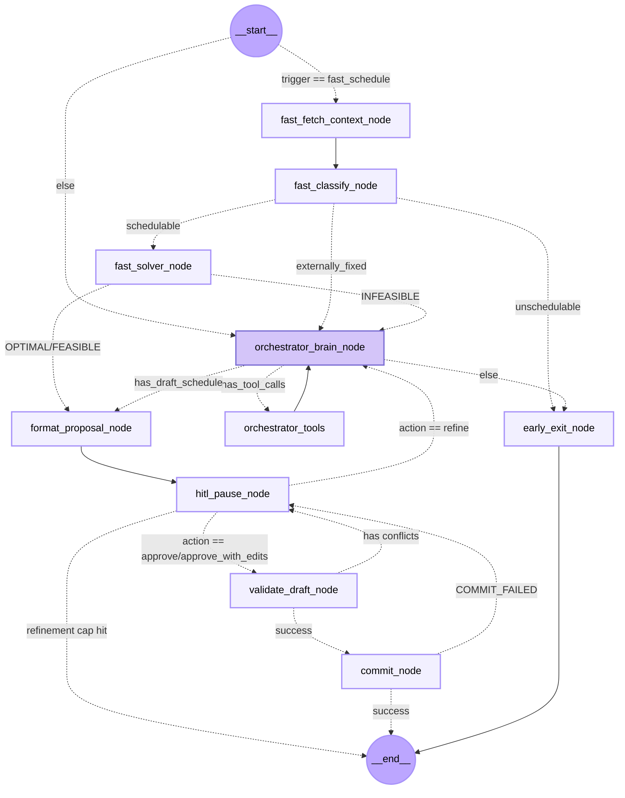

---

**Scheduler Agent**
Takes a user's tasks and places them as calendar sessions, balancing deadlines, work-hour preferences, and existing calendar events — routing simple events through a fast direct solver and complex multi-task jobs through an AI-driven constraint loop.

```mermaid
flowchart TD
    %% Nodes
    START((__start__))
    END_NODE((__end__))
    fast_fetch[fast_fetch_context_node]
    fast_classify[fast_classify_node]
    fast_solver[fast_solver_node]
    early_exit[early_exit_node]
    orch_brain[orchestrator_brain_node]
    orch_tools[orchestrator_tools]
    format_prop[format_proposal_node]
    hitl[hitl_pause_node]
    validate[validate_draft_node]
    commit[commit_node]

    %% Start Routing (_entry_router)
    START -. "trigger == fast_schedule" .-> fast_fetch
    START -. "else" .-> orch_brain

    %% Fast Path
    fast_fetch --> fast_classify
    fast_classify -. "schedulable" .-> fast_solver
    fast_classify -. "externally_fixed" .-> orch_brain
    fast_classify -. "unschedulable" .-> early_exit
    
    fast_solver -. "INFEASIBLE" .-> orch_brain
    fast_solver -. "OPTIMAL/FEASIBLE" .-> format_prop

    %% Orchestrator Tool-Calling Loop (_orchestrator_tool_router)
    orch_brain -. "has_tool_calls" .-> orch_tools
    orch_tools --> orch_brain
    orch_brain -. "has_draft_schedule" .-> format_prop
    orch_brain -. "else" .-> early_exit

    %% Shared Commit & Validation Path
    format_prop --> hitl
    
    %% HITL Routing (_hitl_router)
    hitl -. "action == refine" .-> orch_brain
    hitl -. "refinement cap hit" .-> END_NODE
    hitl -. "action == approve/approve_with_edits" .-> validate
    
    %% Validation Routing (_validate_router)
    validate -. "has conflicts" .-> hitl
    validate -. "success" .-> commit

    %% Commit Routing (_commit_router)
    commit -. "COMMIT_FAILED" .-> hitl
    commit -. "success" .-> END_NODE

    %% Early Exit
    early_exit --> END_NODE

    %% Styling to mimic LangGraph
    classDef default fill:#f2f0ff,stroke:#a893f9,stroke-width:2px,color:#000
    classDef terminal fill:#bca6ff,stroke:#a893f9,stroke-width:2px,color:#000
    classDef process fill:#d4c5f9,stroke:#7c6fd4,stroke-width:2px,color:#000
    class START,END_NODE terminal
    class orch_brain,orchestrator_tools process
```

**Key Engineering Decisions**

**CP-SAT over greedy scheduling**
A greedy algorithm places sessions in the first available slot but cannot optimize across all constraints simultaneously — it misses the global optimum and has no backtracking when it paints itself into a corner. CP-SAT models the full constraint set (deadlines, work windows, session ordering, subject balance caps) and finds the mathematically optimal placement in a single pass. A 10-second solver timeout keeps latency acceptable while guaranteeing optimality up to that budget.

**3-pass constraint relaxation**
When the solver returns INFEASIBLE, the alternative is to fail immediately and ask the user to manually remove tasks. Instead, a three-pass sequence progressively softens constraints — first loosening work-hour boundaries, then allowing displacement of non-fixed events with urgency-weighted penalties — so the system finds a schedule rather than giving up. Only when all three passes and a compromise round exhaust their options does the agent return UNSCHEDULABLE.

**Decomposition caching across solver retries**
Breaking a task into sub-sessions requires an LLM call that is both expensive and non-deterministic. The decomposed sessions are cached per task ID so Pass 1 → Pass 2 → Pass 3 retries reuse the same breakdown without re-querying the model. Only an explicit user request or a `force_redecompose=True` flag clears the cache, preventing redundant generation across the constraint relaxation loop.

---
