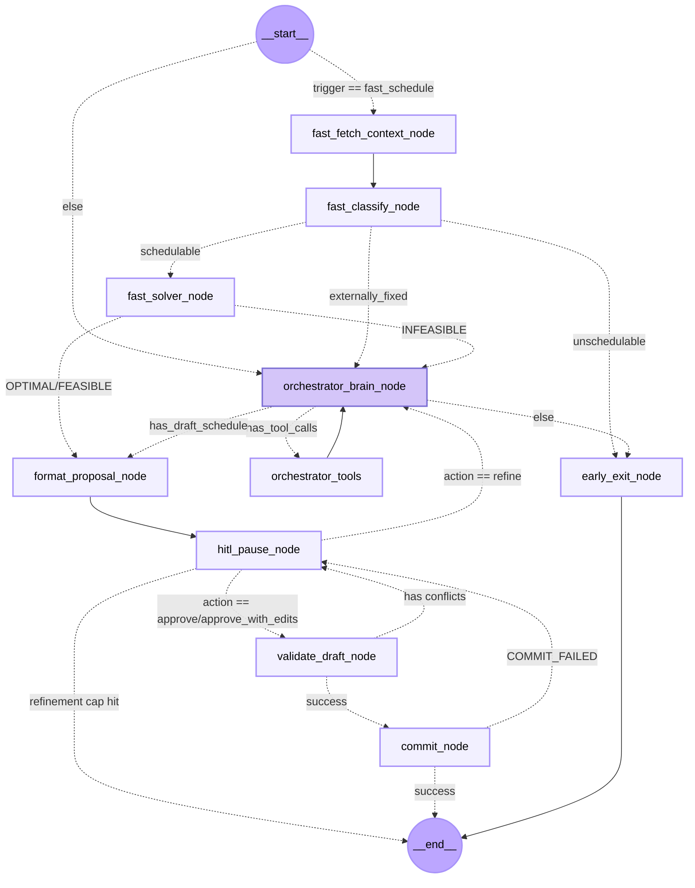

---

## Scheduler Agent
Takes a user's tasks and places them as calendar sessions, balancing deadlines, work-hour preferences, and existing calendar events — routing simple events through a fast direct solver and complex multi-task jobs through an AI-driven constraint loop.

```mermaid
flowchart TD
    %% Nodes
    START((__start__))
    END_NODE((__end__))
    fast_fetch[fast_fetch_context_node]
    fast_classify[fast_classify_node]
    fast_solver[fast_solver_node]
    early_exit[early_exit_node]
    orch_brain[orchestrator_brain_node]
    orch_tools[orchestrator_tools]
    format_prop[format_proposal_node]
    hitl[hitl_pause_node]
    validate[validate_draft_node]
    commit[commit_node]

    %% Start Routing (_entry_router)
    START -. "trigger == fast_schedule" .-> fast_fetch
    START -. "else" .-> orch_brain

    %% Fast Path
    fast_fetch --> fast_classify
    fast_classify -. "schedulable" .-> fast_solver
    fast_classify -. "externally_fixed" .-> orch_brain
    fast_classify -. "unschedulable" .-> early_exit
    
    fast_solver -. "INFEASIBLE" .-> orch_brain
    fast_solver -. "OPTIMAL/FEASIBLE" .-> format_prop

    %% Orchestrator Tool-Calling Loop (_orchestrator_tool_router)
    orch_brain -. "has_tool_calls" .-> orch_tools
    orch_tools --> orch_brain
    orch_brain -. "has_draft_schedule" .-> format_prop
    orch_brain -. "else" .-> early_exit

    %% Shared Commit & Validation Path
    format_prop --> hitl
    
    %% HITL Routing (_hitl_router)
    hitl -. "action == refine" .-> orch_brain
    hitl -. "refinement cap hit" .-> END_NODE
    hitl -. "action == approve/approve_with_edits" .-> validate
    
    %% Validation Routing (_validate_router)
    validate -. "has conflicts" .-> hitl
    validate -. "success" .-> commit

    %% Commit Routing (_commit_router)
    commit -. "COMMIT_FAILED" .-> hitl
    commit -. "success" .-> END_NODE

    %% Early Exit
    early_exit --> END_NODE

    %% Styling to mimic LangGraph
    classDef default fill:#f2f0ff,stroke:#a893f9,stroke-width:2px,color:#000
    classDef terminal fill:#bca6ff,stroke:#a893f9,stroke-width:2px,color:#000
    classDef process fill:#d4c5f9,stroke:#7c6fd4,stroke-width:2px,color:#000
    class START,END_NODE terminal
    class orch_brain,orchestrator_tools process
```

## How it works

### Fast path
For single-event scheduling (`trigger == fast_schedule`)
1. **Fetch context** — Loads user work preferences, preferred/avoid slots, fixed events, non-fixed events, and materialized routine blocks into a 28-day scheduling window.
2. **Classify** — Deterministic keyword rules first (event type, title prefixes); ambiguous items fall back to a Gemini 3 Flash call. Routes to: `schedulable` → solver, `externally_fixed` → orchestrator, `unschedulable` → exit.
3. **Solve** — CP-SAT places the event in the optimal slot within a 10-second budget. INFEASIBLE escalates to the orchestrator path.

### Orchestrator path
For multi-task scheduling, conflict resolution, or fast-path failures
1. **ReAct tool loop** — Gemini 2.5 Pro drives tool calls in sequence: `fetch_calendar_context` → `decompose_task` (LLM breaks the task into ordered sessions, cached per task ID) → `run_ortools_solver` → `propose_compromise` if INFEASIBLE (shrink/postpone/drop directives applied inline). Capped at 10 tool turns.
2. **3-pass relaxation** — CP-SAT retries with progressively relaxed constraints: Pass 1 strict → Pass 2 soften work-hour boundaries → Pass 3 allow displacing non-fixed events (urgency-weighted penalties). Only after all three passes and a compromise round does the agent return UNSCHEDULABLE.

### Shared commit path
3. **Format + HITL** — Proposal normalized with a UUID draft ID (48h TTL). Graph pauses for human review: approve, approve-with-edits, or refine (loops back to orchestrator, max 5 cycles).
4. **Validate** — Re-fetches fixed walls from DB; rejects on overlap and routes back to HITL.
5. **Commit** — Atomic RPC write (`commit_draft_schedule`). DB failure loops back to HITL for retry.

## Key Engineering Decisions

### CP-SAT over greedy scheduling
A greedy algorithm misses the global optimum and has no backtracking when it reaches a dead end. CP-SAT models all constraints (deadlines, work windows, session ordering, subject balance caps) simultaneously, with a 10-second solver timeout guaranteeing optimality up to that budget.

### 3-pass constraint relaxation
When the solver returns INFEASIBLE, a three-pass sequence progressively softens constraints — first loosening work-hour boundaries, then allowing displacement of non-fixed events with urgency-weighted penalties — rather than failing immediately. Only after all three passes and a compromise round does the agent return UNSCHEDULABLE.

### Decomposition caching across solver retries
Task decomposition is an expensive, non-deterministic LLM call. Results are cached per task ID so Pass 1 → Pass 2 → Pass 3 retries reuse the same session breakdown without re-querying the model.

---
