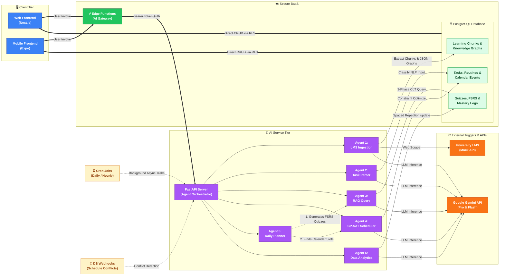

# FYP Poster Combined Hero Diagram & Architecture Overview

> **Purpose:** A single, unified architecture flowchart designed as the central diagram for your project poster, accompanied by a comprehensive description suitable for the FYP report or poster text.

---

## The Combined Architecture Flowchart

---

## High-Level System Architecture Overview

The **AI Academic Assistant** operates on a robust, multi-tier microservices architecture designed for scalability, security, and real-time responsiveness. The system is physically and logically separated into four distinct repositories that work together seamlessly.

### 1. The Client Tier (Cross-Platform Frontends)
The user-facing layer consists of two parallel codebases: the **Web Frontend** (`fyp-web-frontend`) built with Next.js 16, and the **Mobile Frontend** (`fyp-mobile-frontend`) built with React Native (Expo). 
* **Shared Logic:** Both platforms enforce UI consistency through `shadcn` components and share the exact same state management architecture using `Zustand`. 
* **Direct Database Access:** For standard operations (fetching tasks, creating routines, editing profiles), both clients communicate directly with the PostgreSQL database. Security is heavily enforced at the database level via **Row Level Security (RLS)**, ensuring users can only read and mutate their own data.

### 2. The Backend-as-a-Service Tier (Supabase)
The **Supabase Backend** (`fyp-supabase-backend`) acts as the central nervous system of the platform.
* **Authentication:** Managed by Supabase Auth (GoTrue), delivering secure JWT-based user sessions that automatically map to PostgreSQL Row Level Security policies.
* **PostgreSQL:** Stores all relational data (tasks, groups, routines) and implements Structured RAG by filtering metadata within the `learning_chunks` table, eliminating the need for vector embeddings.
* **Storage:** Manages file uploads natively, specifically holding PDF lecture notes and user-uploaded images (for OCR parsing) in secure S3-compatible buckets.
* **Secure AI Gateway:** To protect the AI infrastructure, the frontends *never* communicate directly with the AI Service. Instead, clients invoke **Supabase Edge Functions**. These serverless functions act as a secure gateway, verifying the user's JWT session, injecting a secure Bearer Token, and proxying the request to the internal Python AI server.

### 3. The AI Service Tier (The Brain)
Hosted separately, the **AI Service** (`fyp-ai-service`) is a Python FastAPI microservice that houses the platform's core intelligence. It is orchestrated using **LangGraph**, enabling complex, stateful, multi-agent workflows. The logic is divided among six highly specialized agents:
* **Agent 1 (LMS Ingestion):** Wakes up via hourly cron jobs, scrapes the University Mock LMS, chunks lecture slides via Docling, and extracts semantic knowledge graphs (stored as JSONB) and structured learning chunks.
* **Agent 2 (Task Parser):** Receives unstructured user input (text or images via OCR) and uses Gemini Flash to automatically classify and parse them into structured Tasks, Events, or Routines.
* **Agent 3 (RAG Query):** Employs a rigorous 3-Phase Chain-of-Thought (CoT) technique to generate contextually accurate quizzes, summaries, and mindmaps from the ingested structured learning chunks and JSON knowledge graphs.
* **Agent 4 (Scheduler):** The algorithmic core. It leverages Google OR-Tools (CP-SAT Solver) to dynamically fit user tasks into empty calendar slots while respecting hard constraints (class times) and soft constraints (preferred study hours).
* **Agent 5 (Daily Planner):** An autonomous Python loop running at 06:00 AM local time. It proactively evaluates the student's day, automatically triggering Agent 3 to generate consolidation quizzes for today's lectures, and triggering Agent 4 to schedule them.
* **Agent 6 (Analytics):** Computes spaced-repetition metrics using the FSRS (Free Spaced Repetition Scheduler) algorithm, tracking knowledge decay and optimizing future quiz difficulties.

### 4. External Services
The AI service heavily relies on the **Google Gemini API** for Large Language Model (LLM) inference. By routing requests dynamically between Gemini 1.5 Pro (for complex RAG generation) and Gemini 1.5 Flash (for fast NLP classification), the system balances speed, cost, and high-quality academic reasoning.
